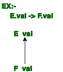
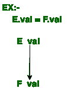

# 合成属性和继承属性的区别

> 原文:[https://www . geeksforgeeks . org/合成和继承属性之间的差异/](https://www.geeksforgeeks.org/differences-between-synthesized-and-inherited-attributes/)

在[语法定向定义](https://www.geeksforgeeks.org/compiler-design-syntax-directed-translation/)中，使用了两个属性，一个是合成属性，另一个是继承属性。如果一个属性的解析树节点值由子节点处的属性值决定，则称其为[合成属性](https://www.geeksforgeeks.org/s-attributed-and-l-attributed-sdts-in-syntax-directed-translation/)，而如果其解析树节点值由父节点和/或兄弟节点处的属性值决定，则称其为**继承属性**。

现在，我们将看到合成属性和继承属性之间的比较。
这两个属性的对比如下:

| S.NO | 合成属性 | 继承的属性 |
| 1. | 如果一个属性的解析树节点值是由子节点的属性值决定的，那么这个属性被称为合成属性。 | 如果一个属性的解析树节点值由父节点和/或兄弟节点的属性值决定，则称该属性为继承属性。 |
| 2. | 生产必须以非终端为头。 | 产品的主体中必须有非终端作为符号。 |
| 3. | 节点 n 处的合成属性仅根据 n 本身的子节点处的属性值来定义。 | 节点 n 处的继承属性仅根据 n 的父节点、n 本身以及 n 的兄弟节点的属性值来定义。 |
| 4. | 它可以在解析树的单次自底向上遍历中进行评估。 | 它可以在解析树的单次自顶向下和横向遍历中进行评估。 |
| 5. | 终端或非终端都可以包含合成属性。 | 继承的属性不能被两者都包含，只能被非终结符包含。 |
| 6. | 合成属性同时被 S 属性 SDT 和 L 属性 STD 使用。 | 继承的属性仅由 L 属性的 SDT 使用。 |
| 7. | 

 | 

 |

