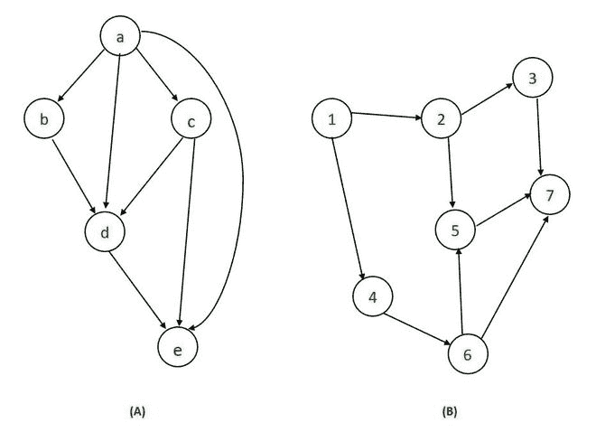
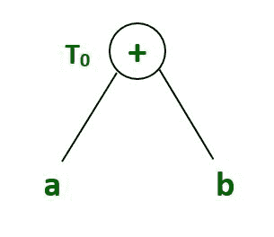
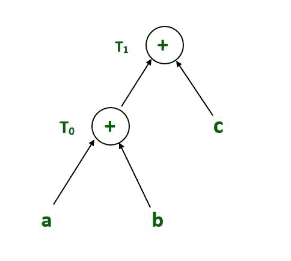
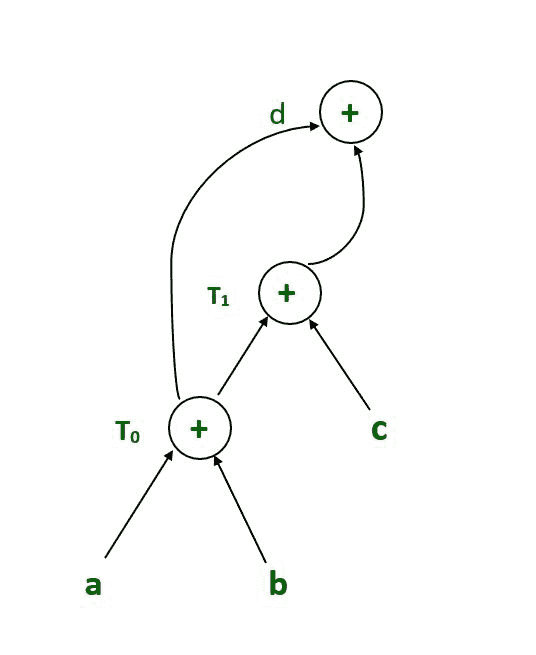
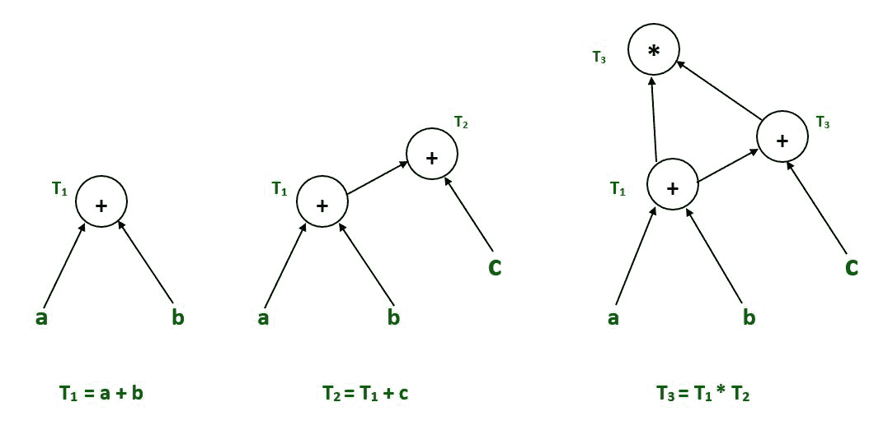
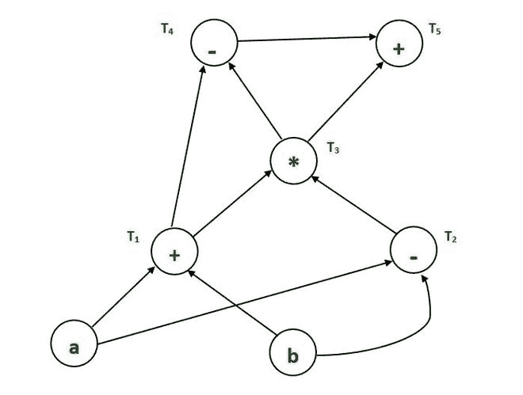
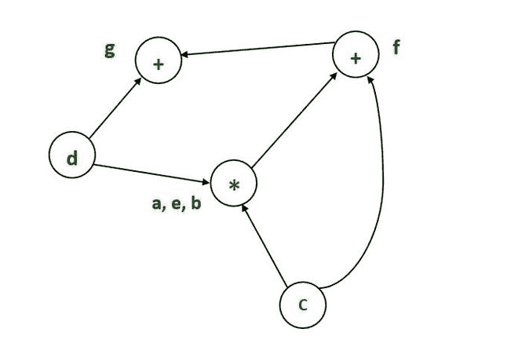
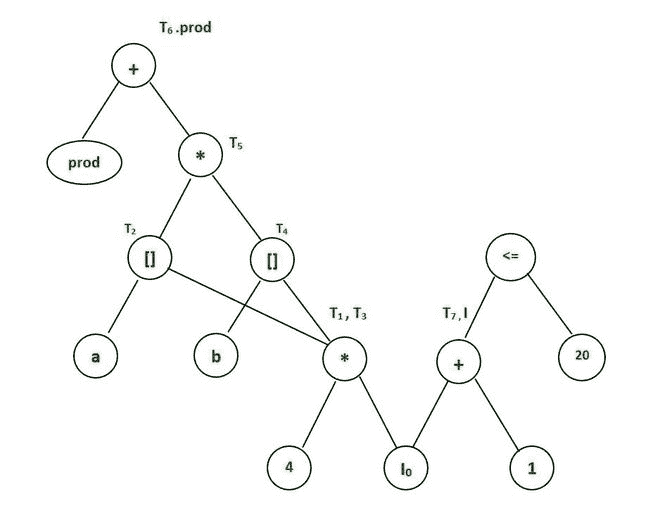

# 编译器设计中的有向无环图(附示例)

> 原文:[https://www . geeksforgeeks . org/有向无环图编译器设计示例/](https://www.geeksforgeeks.org/directed-acyclic-graph-in-compiler-design-with-examples/)

**有向无环图:**
有向无环图(DAG)用于表示[基本块](https://www.geeksforgeeks.org/basic-blocks-in-compiler-design/)的结构，可视化基本块之间的值流，并在基本块中提供优化技术。为了将优化技术应用于基本块，DAG 是作为中间代码生成的结果而生成的三地址代码。

*   有向无环图是一种数据结构，用于对基本块进行转换。
*   有向无环图有助于基本块的转换。
*   DAG 是一种识别常见子表达式的有效方法。
*   它演示了如何在后续语句中使用语句的计算值。

**有向无环图示例:**

**有向无环图特征:**
[基本块](https://www.geeksforgeeks.org/basic-blocks-in-compiler-design/)的有向无环图是一个有向无环图，节点上有以下标签。

*   该图的每个叶子都有一个唯一的标识符，可以是变量名或常量。
*   图的内部节点用一个操作符标记。
*   此外，节点被赋予一串标识符，用作存储计算值的标签。
*   有向无环图对传递闭包和传递约简有自己的定义。
*   有向无环图定义了[拓扑顺序](https://www.geeksforgeeks.org/topological-sorting/)。

**构建有向无环图的算法:**
在三个地址码上构建 DAG 有三种可能的情况:

**案例 1–**x = y op z
T3】案例 2–x = op y
T6】案例 3–x = y

上述情况的有向无环图可以构建如下:

**步骤 1–**

*   如果未定义 y 操作数，则创建一个节点(y)。
*   如果未定义 z 操作数，请为案例(1)创建一个节点作为节点(z)。

**步骤 2–**

*   为案例(1)创建节点(OP)，将节点(z)作为其子节点，将节点(OP)作为其子节点(y)。
*   对于情况(2)，查看是否有一个带有一个子节点(y)的节点运算符(OP)。
*   在情况(3)中，节点 n 将是节点(y)。

**步骤 3–**
从节点标识符列表中删除 x。步骤 2:将 x 添加到节点 n 的附加标识符列表中

**示例:**

> T0= a+b—表达式 1
> T 1 = T 0 + c —表达式 2
> d = T0+T1—表达式 3

**表达式 1 : T 0 = a + b**

**表达式 2: T 1 = T 0 + c**

**表达式 3 : d = T 0 + T 1**

最终有向无环图

**示例:**

> T1= a+b
> T2= T1+c
> T3= T1×T2

**示例:**

> T1= a+b
> T2= a–b
> T3= T1* T2T12】T4= T1–T3T19】T5= T4+T3

最终有向无环图

**示例:**

> a = b x c
> d = b
> e = d x c
> b = e
> f = b+c
> g = f+d

最终有向无环图

**示例:**

> T 1 := 4*I 0
> 
> T2:a【T1
> 
> T 3 := 4*I 0
> 
> T4:= b【T3
> 
> T5:= T2* T4
> 
> T 6 := prod + T 5
> 
> prod:= T 6
> 
> T 7 := I 0 + 1
> 
> I 0 := T 7
> 
> 如果我 0 < = 20 转到 1

最终有向无环图

**有向无环图的应用:**

*   有向无环图决定了常用的子表达式。
*   有向无环图确定块内使用的名称以及块外计算的名称。
*   确定块中哪些语句的计算值可能在块外。
*   代码可以用有向无环图来表示，该图描述了代码中执行的每个算术运算的输入和输出；这种表示允许编译器有效地执行公共子表达式消除。
*   几种编程语言描述由有向无环图链接在一起的价值系统。当一个值改变时，它的后继值被重新计算；DAG 中的每个值都是作为其前身的函数来计算的。