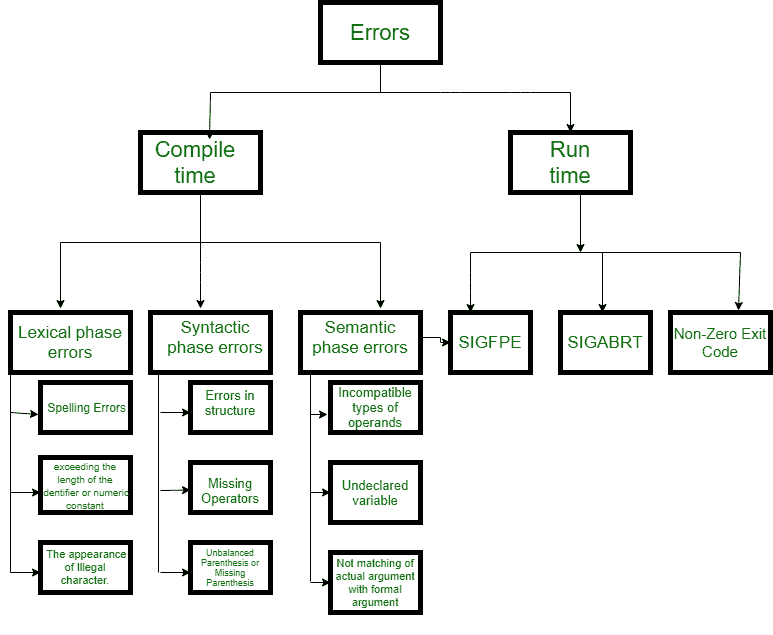
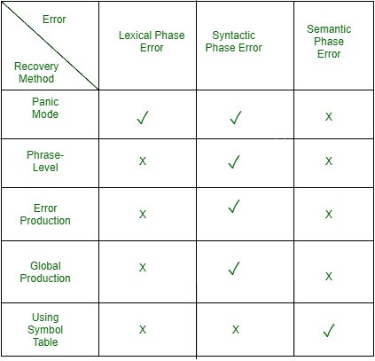

# 编译器设计中的错误处理

> 原文:[https://www . geesforgeks . org/错误处理-编译器-设计/](https://www.geeksforgeeks.org/error-handling-compiler-design/)

**错误处理**流程的任务是检测每个错误，并向用户报告，然后制定一些恢复策略并实施以处理错误。在整个过程中，程序的处理时间不应该太慢。

错误处理程序的功能:

*   误差检测
*   错误报告
*   错误校正

```
Error handler=Error Detection+Error Report+Error Recovery.
```

一个**错误**是符号表中的空白条目。

解析器应该检测并报告程序中的错误。每当出现错误时，解析器都可以处理它，并继续解析输入的其余部分。虽然解析器主要负责检查错误，但是在编译过程的不同阶段可能会出现错误。
因此，错误的类型有很多，其中一些是:
**类型**或**错误的来源–**有三种类型的错误:逻辑错误、运行时错误和编译时错误:

1.  **逻辑错误**发生在程序运行不正常但没有异常终止(或崩溃)的时候。逻辑错误可能会导致意外或不希望的输出或其他行为，即使它没有立即被识别出来。
2.  一个**运行时错误**是发生在程序执行过程中的一个错误，通常是因为不利的系统参数或无效的输入数据而发生的。缺乏足够的内存来运行一个应用程序，或者内存与另一个程序冲突以及逻辑错误就是一个例子。当执行的代码没有产生预期的结果时，就会出现逻辑错误。逻辑错误最好通过细致的程序调试来处理。
3.  **编译时错误**在编译时上升，在程序执行之前。语法错误或缺少文件引用使程序无法成功编译就是一个例子。



**编译时错误的分类–**

1.  **词法**:这包括标识符、关键字或运算符的拼写错误
2.  **句法**:缺少分号或者括号不平衡
3.  **语义**:运算符和操作数之间不兼容的赋值或类型不匹配
4.  **逻辑**:代码不可达，无限循环。

**发现错误或报告错误–**可行前缀是解析器的属性，允许早期检测语法错误。

*   **目标**尽快检测到错误，而不进一步消耗不必要的输入
*   **如何:**一旦输入的前缀与语言中任何字符串的前缀不匹配，就检测到错误。

**例:**为(**；**)，这将报告一个关于大括号内有两个分号的错误。

**错误恢复–**
对编译器的基本要求就是简单的停止并发出消息，停止编译。以下是一些常见的恢复方法。

我们已经讨论了错误。现在，让我们试着理解编译器每个阶段的错误恢复。



**1。恐慌模式恢复:**
这是最简单的错误恢复方式，同时，它防止解析器在恢复错误时开发无限循环。解析器一次丢弃一个输入符号，直到找到一组指定的(如 end、分号)同步标记(通常是语句或表达式终止符)。当同一语句中很少出现多个错误时，这就足够了。示例:考虑错误的表达式- (1 + + 2) + 3。紧急模式恢复:跳到下一个整数，然后继续。Bison:使用特殊终端**错误**描述跳过多少输入。

```
E->int|E+E|(E)|error int|(error) 
```

**2。阶段级恢复:**
当发现错误时，解析器会对剩余的输入执行本地纠正。如果解析器遇到错误，它会对剩余的输入进行必要的更正，以便解析器可以继续解析语句的剩余部分。您可以通过删除多余的分号、用分号替换逗号或重新引入缺少的分号来更正错误。为了防止在校正过程中进入无限循环，应格外小心。只要在剩余的输入中找到任何前缀，它就会被替换为某个字符串。通过这种方式，解析器可以继续执行操作。

**3。错误产生:**
如果用户意识到语法中遇到的常见错误以及产生错误结构的错误，则可以使用错误产生方法。当使用这种方法时，解析过程中可能会生成错误消息，解析可以继续。示例:写 5x 而不是 5*x

**4。全局校正:**
为了从错误的输入中恢复，解析器分析整个程序，并试图为其找到最接近的匹配，这是没有错误的。最接近的匹配是不进行许多插入、删除和令牌更改的匹配。这种方法由于时间和空间的复杂性而不实用。

下一篇相关文章–[编译器中的错误检测和恢复](https://www.geeksforgeeks.org/error-detection-recovery-compiler/)