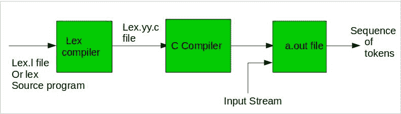
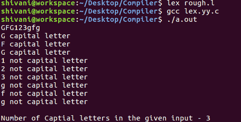
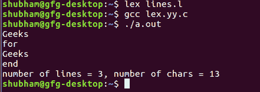

# Flex(快速词法分析器生成器)

> 原文:[https://www . geesforgeks . org/flex-fast-词法分析器-生成器/](https://www.geeksforgeeks.org/flex-fast-lexical-analyzer-generator/)

**FLEX(快速词法分析器生成器)**是 Vern Paxson 在 1987 年前后用 C 语言编写的一个用于生成词法分析器(扫描仪或 lexers)的工具/计算机程序。与[柏克莱 Yacc 解析器生成器](https://en.wikipedia.org/wiki/Berkeley_Yacc)或 [GNU Bison 解析器生成器](https://en.wikipedia.org/wiki/GNU_bison)配合使用。Flex 和 Bison 都比 lex 和 Yacc 更灵活，产生的代码也更快。
Bison 从用户提供的输入文件中生成解析器。功能 **yylex()** 由 flex 提供**时自动生成。l 文件**并且解析器期望这个 yylex()函数调用来从当前/这个令牌流中检索令牌。

**注意:**函数 yylex()是运行规则部分和扩展()的主要 flex 函数。l)是用于保存程序的扩展名。

**在 Ubuntu 上安装 Flex:**

```
sudo apt-get update
sudo apt-get install flex
```

**注意:**如果更新命令暂时没有在机器上运行，最好先运行它，以便安装一个新版本，因为旧版本可能无法与安装的其他软件包一起工作，或者现在可能不存在。

给定的图像描述了如何使用 Flex:



**第一步:**一个描述将要生成的词法分析器 lex.l 的输入文件是用 lex 语言编写的。lex 编译器将 lex.l 转换成 C 程序，在一个总是被命名为 lex.yy.c.
**的文件中步骤 2:**C 编译器将 lex.yy.c 文件编译成一个被称为 a.out.
**的可执行文件步骤 3:** 输出文件 a.out 获取一个输入字符流并产生一个标记流。

**程序结构:**

在输入文件中，有 3 个部分:

**1。定义部分:**定义部分包含变量、常规定义、清单常量的声明。在定义部分，文本包含在**“% { % }”**括号中。括号内的内容直接复制到文件 **lex.yy.c**

**语法:**

```
%{
   // Definitions
%}
```

**2。规则部分:**规则部分包含一系列规则，其形式为:*模式动作*和模式必须是非预期的，并且动作在{}括号中的同一行开始。规则部分包含在**“% % %”**中。

**语法:**

```
%%
pattern  action
%%
```

**示例:下表显示了一些模式匹配。**

<figure class="table">

| 模式 | 它可以与 |
| --- | --- |
| [0-9] | 0 到 9 之间的所有数字 |
| [0+9] | 0、+或 9 |
| [0, 9] | 0 '，'或 9 |
| [0 9] | 0 '或 9 |
| [-09] | -0 或 9 |
| [-0-9] | 0 到 9 之间的任一–或所有数字 |
| [0-9]+ | 0 到 9 之间一个或多个数字 |
| [^a] | 除了 a 以外的所有其他字符 |
| [^A-Z] | 除大写字母以外的所有其他字符 |
| {2，4} | aa、aaa 或 aaaa |
| {2，} | 出现两次或更多次 |
| {4} | 准确地说是 4 a，也就是 aaaa |
| 。 | 除换行符以外的任何字符 |
| a* | 出现 0 次或更多次 |
| a+ | 一次或多次出现 |
| [a-z] | 所有小写字母 |
| [一个接一个] | 任何字母 |
| w(x &#124; y)z | wxz 或 wyz |

**3。用户代码部分:**该部分包含 C 语句和附加功能。我们也可以单独编译这些函数，并用词法分析器加载。

基本程序结构:

```
%{
// Definitions
%}

%%
Rules
%%

User code section
```

**如何运行程序:**
要运行程序，首先要用扩展名**保存。l 或。莱克斯**。在终端上运行以下命令以运行程序文件。

**第一步:** lex filename.l 或 lex filename.lex 根据扩展名文件与
**一起保存第二步:** gcc lex.yy.c
**第三步:**。/a.out
**步骤 4:** 在需要时向程序提供输入

**注意:**按 **Ctrl+D** 或者使用一些**规则**来停止接收用户的输入。请查看以下程序的输出图像，以明确是否有疑问运行程序。

**例 1:计算一个字符串中的字符数**

## C

```
/*** Definition Section has one variable
which can be accessed inside yylex() 
and main() ***/
%{
int count = 0;
%}

/*** Rule Section has three rules, first rule 
matches with capital letters, second rule
matches with any character except newline and 
third rule does not take input after the enter***/
%%
[A-Z] {printf("%s capital letter\n", yytext);
       count++;}
.     {printf("%s not a capital letter\n", yytext);}
\n    {return 0;}
%%

/*** Code Section prints the number of
capital letter present in the given input***/
int yywrap(){}
int main(){

// Explanation:
// yywrap() - wraps the above rule section
/* yyin - takes the file pointer 
          which contains the input*/
/* yylex() - this is the main flex function
          which runs the Rule Section*/
// yytext is the text in the buffer

// Uncomment the lines below 
// to take input from file
// FILE *fp;
// char filename[50];
// printf("Enter the filename: \n");
// scanf("%s",filename);
// fp = fopen(filename,"r");
// yyin = fp;

yylex();
printf("\nNumber of Capital letters " 
      "in the given input - %d\n", count);

return 0;
}
```

**输出:**



**例 2:统计输入的字符数和行数**

## C

```
/* Declaring two counters one for number 
of lines other for number of characters */
%{
int no_of_lines = 0;
int no_of_chars = 0;
%}

/***rule 1 counts the number of lines, 
rule 2 counts the number of characters 
and rule 3 specifies when to stop 
taking input***/
%%
\n      ++no_of_lines;
.       ++no_of_chars;
end     return 0;
%%

/*** User code section***/
int yywrap(){}
int main(int argc, char **argv)
{

yylex();
printf("number of lines = %d, number of chars = %d\n",
       no_of_lines, no_of_chars );

return 0;
}
```

**输出:**



</figure>