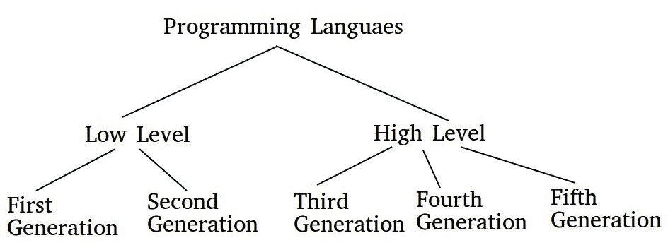

# 编程语言的产生

> 原文:[https://www . geesforgeks . org/generation-programming-languages/](https://www.geeksforgeeks.org/generation-programming-languages/)

编程语言有五代。它们是:
**第一代语言:**
这些都是像机器语言一样的低级语言。
**第二代语言:**
这些是内核和硬件驱动中使用的低级汇编语言。
**第三代语言:**
这些是高级语言，如 C、C++、Java、Visual Basic 和 JavaScript。
**第四代语言:**
这些语言由与人类语言中的语句相似的语句组成。这些主要用于数据库编程和脚本编写。这些语言的例子包括 Perl、Python、Ruby、SQL、MatrixLaboratory。
**第五代语言:**
这些是拥有可视化工具开发程序的编程语言。第五代语言的例子包括水星、OPS5 和 Prolog。

前两代被称为低级语言。接下来的三代被称为高级语言。

本文由 [**帕杜楚里·马尼迪普**](https://auth.geeksforgeeks.org/profile.php?user=MANIDEEP007) 供稿。如果你喜欢 GeeksforGeeks 并想投稿，你也可以用[write.geeksforgeeks.org](https://write.geeksforgeeks.org)写一篇文章或者把你的文章发邮件给 review-team@geeksforgeeks.org。看到你的文章出现在极客博客主页上，帮助其他极客。

如果你发现任何不正确的地方，或者你想分享更多关于上面讨论的话题的信息，请写评论。

**1。第一代语言:**

第一代语言也被称为机器语言/ 1G 语言。这种语言依赖于机器。机器语言语句是用二进制代码(0/1 形式)编写的，因为计算机只能理解二进制语言。

**优势:**

1.快速高效，因为语句是直接用二进制语言编写的。

2.不需要翻译。

**缺点:**

1.二进制代码难学。

2.很难理解–两个程序–错误发生在哪里。

**2。第二代语言:**

第二代语言也被称为汇编语言/ 2G 语言。汇编语言包含人类可读的符号，可以使用汇编程序进一步转换为机器语言。

**汇编程序–**将汇编级指令转换为机器级指令。

程序员可以使用符号指令代码来编写代码，这些符号指令代码是助记符的有意义缩写。它也被称为低级语言。

**优势:**

1.如果与机器语言相比，它更容易理解。

2.修改很容易。

3.错误的纠正和定位很容易。

**缺点:**

1.需要汇编程序。

2.这种语言依赖于体系结构/机器，不同的机器有不同的指令集。

3.第三代语言:

第三代也叫过程语言/3 GL。它包括使用一系列人类容易理解的类似英语的单词来写指令。它也被称为高级编程语言。为了执行，需要使用编译器/解释器将这种语言的程序翻译成机器语言。这类语言的例子有 C，PASCAL，FORTRAN，COBOL 等。

**优势:**

1.使用类似英语的单词使其成为人类可以理解的语言。

2.与上述两种语言相比，代码行数更少。

3.相同的代码可以复制到另一台机器上&通过使用该机器特定的编译器在该机器上执行。

**缺点:**

1.需要编译器/解释器。

2.不同的机器需要不同的编译器。

**4。第四代语言:**

第四代语言也被称为非过程语言/ 4GL。它使用户能够访问数据库。例子:SQL，Foxpro，Focus 等。

这些语言也易于理解。

**优势:**

1.易于理解和学习。

2.创建应用程序所需的时间更少。

3.它不太容易出错。

**缺点:**

1.内存消耗高。

2.对硬件控制不佳。

3.不太灵活。

**5。第五代语言:**

第五代语言也叫 5GL。它基于人工智能的概念。它使用的概念是，不是通过算法来解决问题，而是可以基于一些约束来构建应用程序来解决问题，也就是说，我们让计算机学会解决任何问题。并行处理&超导体用于这种类型的语言，以制造真正的人工智能。

例如:PROLOG、LISP 等。

**优势:**

1.机器可以做决定。

2.程序员减少了解决问题的努力。

3.比 3GL 或 4GL 更容易学习和使用。

**缺点:**

1.复杂而冗长的代码。

2.需要更多的资源&它们也很昂贵。