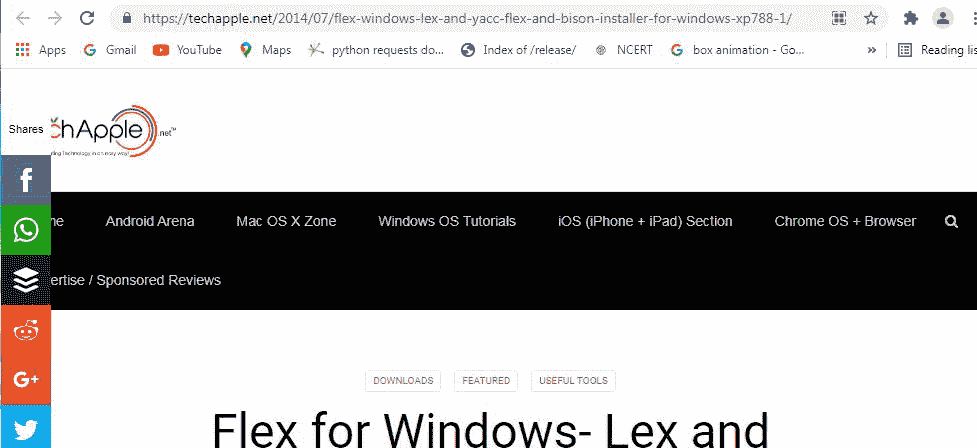
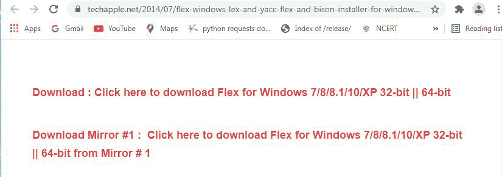
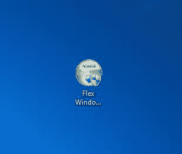
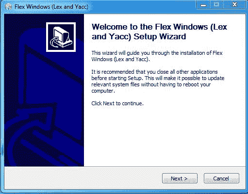
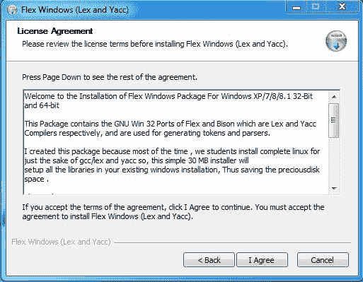
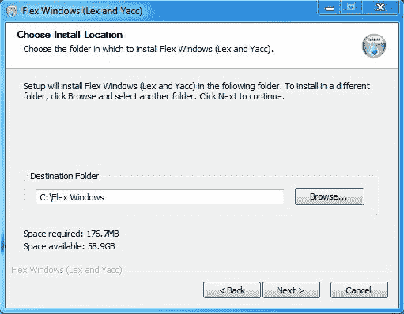
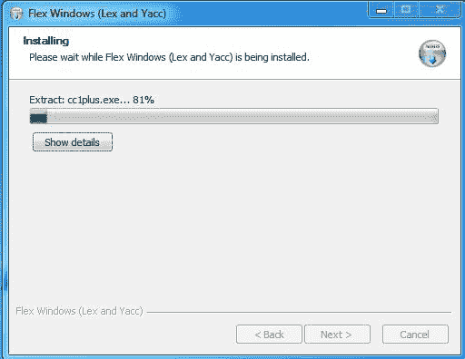
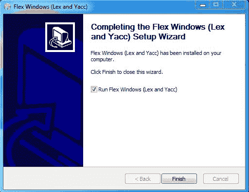
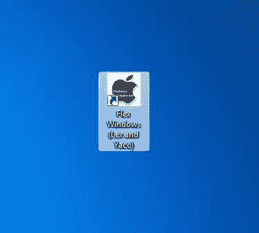

# 如何在 Windows 上安装 Flex？

> 原文:[https://www . geeksforgeeks . org/如何在 windows 上安装 flex/](https://www.geeksforgeeks.org/how-to-install-flex-on-windows/)

**Flex** 代表快速词法分析器生成器，它是一个计算机应用程序，用于为用 lex 语言编写的程序生成词法分析器。词法分析器的主要工作是将程序转换成一系列标记。它是由凡尔纳·帕克森开发的。它是用 C 语言编写的免费软件，可以在不同的平台上运行，如 Linux、Unix、windows、mac 等。它的首次发行是在 1987 年，第一次稳定发行是在 2017 年。Flex 有一个限制，只能为 C 和 C++生成代码。

**YACC** 代表另一个编译器，它是一个解析器生成器，与 lex 一起使用来生成 lex 文件的解析器。它使用 LALR(1)解析技术，LALR 表示从左向右向前看，1 表示最右边的派生与 1 个向前看标记一起使用。

### **Lex 文件的格式:**

lex 文件有 3 个主要组件:

*   **定义部分:**第一部分是定义部分，这个部分用于包含程序的库和头文件。这个部分能够接受用 c 语言编写的代码。

**定义部分示例:**

```
%{
#include <stdio.h>
#include<conio.h>
%}
```

*   **规则节:**第二节是规则节，这一节的主要工作是利用这一节写的正则表达式进行模式匹配。

**规则部分示例:**

```
%%
[a-zA-Z]    this pattern will search for alphabets in lower and upper case
%%
```

*   **代码段:**这是用于为程序编写所有逻辑、函数和语句的最后一段。这段代码是用 C 语言写的。该程序将具有 C 程序的所有功能。

**代码段示例:**

```
int main()
{
yylex();
return 0;
}
```

### **Flex 的工作方式:**


### **在 Windows 上安装 Flex:**

按照以下步骤在 Windows 上安装 Flex:

**第一步:**使用任何网络浏览器访问此[网址](https://techapple.net/2014/07/flex-windows-lex-and-yacc-flex-and-bison-installer-for-windows-xp788-1/)。



**步骤 2:** 在此页面上，给出了系统安装 flex 的所有功能和最低要求。这里给出了 Windows XP、7、8 等的 flex 程序的下载链接。点击下载链接，可执行文件的下载将很快开始。这是一个 30.19 兆字节的小文件，几乎不需要一分钟。



**第 3 步:**现在在系统的下载中检查可执行文件并运行它。



**第四步:**会提示确认对你的系统进行修改。单击是。


**第五步:**设置画面出现，点击下一步。



**第 6 步:**下一屏是许可协议，点击我同意。



**第 7 步:**下一个屏幕是安装位置，所以选择有足够内存空间安装的驱动器。它只需要 176.7 兆的内存空间。



**第 8 步:**下一个屏幕将选择开始菜单文件夹，所以不要做任何事情，只需点击下一步按钮。


**第 9 步:**此安装过程开始后，几乎不需要一分钟就能完成安装。



**步骤 10:** 安装过程完成后，点击完成。如果您想立即运行 Flex，请保留复选框上的勾号，否则取消选中。



**步骤 11:** Flex Windows 已成功安装在系统上，并在桌面上创建了一个图标



**第 12 步:**运行软件，看到界面。


恭喜你！！此时，您已经在 windows 系统上成功安装了 Flex。