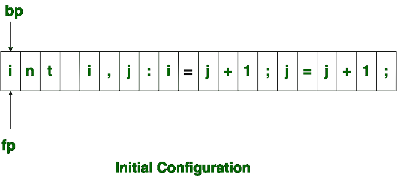
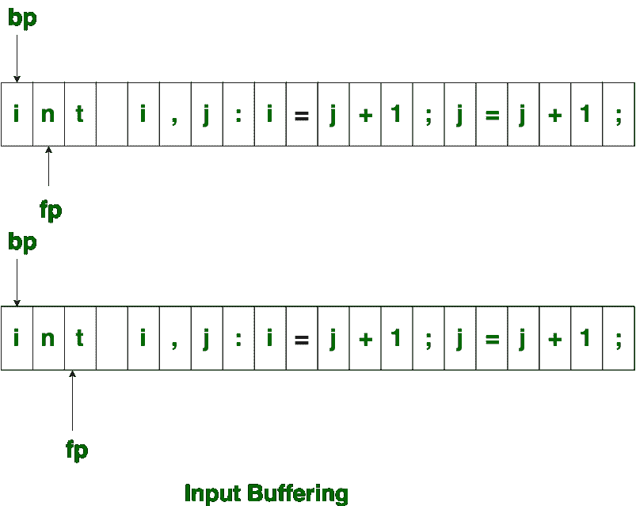
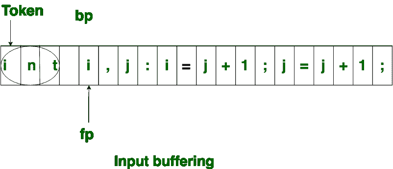
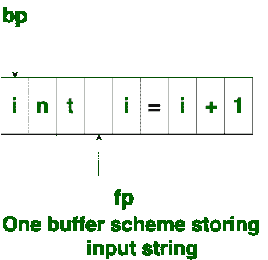
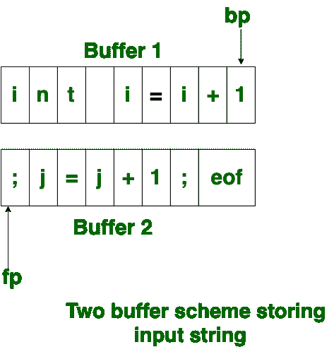

# 编译器设计中的输入缓冲

> 原文:[https://www . geesforgeks . org/input-buffering-in-compiler-design/](https://www.geeksforgeeks.org/input-buffering-in-compiler-design/)

词法分析器一次从左到右扫描一个字符的输入。它使用两个指针开始 ptr( **bp** )并向前跟踪被扫描输入的指针。

最初，两个指针都指向输入字符串的第一个字符，如下所示

向前的 ptr 向前移动以搜索 lexeme 的结尾。一遇到空格，就表示词位结束。在上面的例子中，一旦 ptr (fp)遇到空格，lexeme“int”就被识别出来。

fp 会在空格处向前移动，当 fp 遇到空格时，它会忽略并向前移动。那么开始 ptr(bp)和转发 ptr(fp)都被设置在下一个令牌上。

因此，输入字符是从二级存储器中读取的，但是以这种方式从二级存储器中读取是昂贵的。因此使用缓冲技术。数据块首先被读入缓冲区，然后被词法分析器读取。在本文中使用了两种方法:一种缓冲方案和两种缓冲方案。这些解释如下。

1.  **One Buffer Scheme:**
    In this scheme, only one buffer is used to store the input string but the problem with this scheme is that if lexeme is very long then it crosses the buffer boundary, to scan rest of the lexeme the buffer has to be refilled, that makes overwriting the first of lexeme.

    

2.  **Two Buffer Scheme:**
    To overcome the problem of one buffer scheme, in this method two buffers are used to store the input string. the first buffer and second buffer are scanned alternately. when end of current buffer is reached the other buffer is filled. the only problem with this method is that if length of the lexeme is longer than length of the buffer then scanning input cannot be scanned completely.

    最初，bp 和 fp 都指向第一个缓冲区的第一个字符。然后 fp 向右移动，寻找 lexeme 的结尾。一旦识别出空白字符，bp 和 fp 之间的字符串就被识别为相应的标记。为了识别，缓冲区字符的第一个缓冲区结尾的边界应该放在第一个缓冲区的结尾。

    类似地，第二缓冲区的结尾也可以通过出现在第二缓冲区结尾的缓冲区结尾标记来识别。当 fp 遇到第一个的**时，可以识别第一个缓冲区的结束，从而开始填充第二个缓冲区。同样，当获得第二个**的**时，它指示第二个缓冲区。可替换地，两个缓冲器都可以被填满，直到输入程序结束，并且令牌流被识别。结尾介绍的这个**字符的**是调用 **Sentinel** ，用来标识缓冲区的结束。**

    