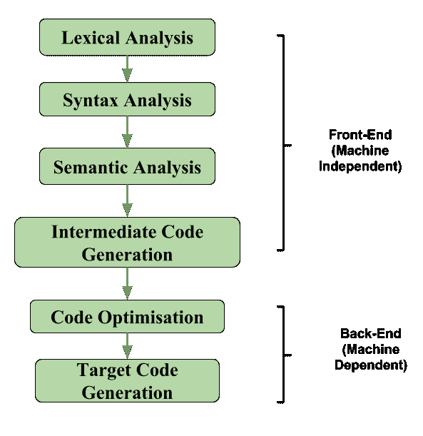
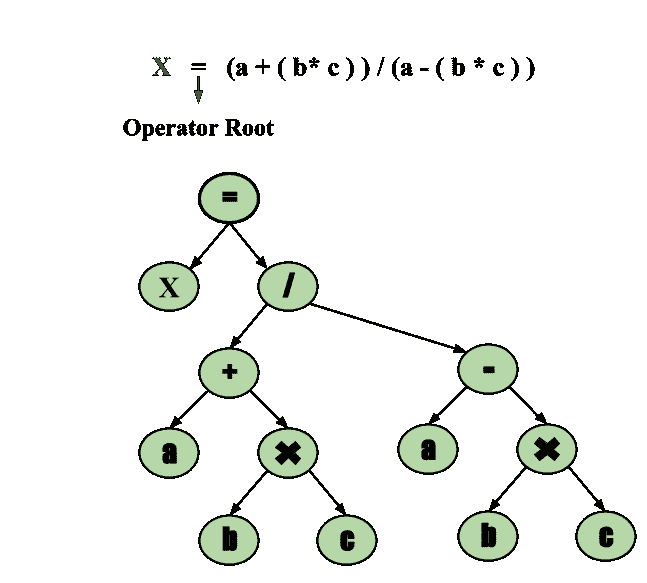

# 编译器设计中的中间代码生成

> 原文:[https://www . geesforgeks . org/intermediate-code-generation in-compiler-design/](https://www.geeksforgeeks.org/intermediate-code-generation-in-compiler-design/)

在编译器的分析-综合模型中，编译器的前端将源程序翻译成独立的中间代码，然后编译器的后端使用这个中间代码生成目标代码(机器可以理解)。

使用独立于机器的中间代码的好处是:

*   由于机器独立的中间代码，可移植性将得到增强。例如，假设一个编译器将源语言翻译成它的目标机器语言，而没有生成中间代码的选项，那么对于每台新机器，需要一个完整的本机编译器。因为，很明显，根据机器规格，编译器本身有一些修改。
*   便于重定目标
*   通过优化中间代码，更容易应用源代码修改来提高源代码的性能。

如果我们直接从源代码生成机器代码，那么对于 n 个目标机器，我们将有 n 个优化器和 n 个代码生成器，但是如果我们将有一个独立于机器的中间代码，
我们将只有一个优化器。中间代码可以是语言特定的(例如，Java 的字节码)或语言。独立(三地址码)。

以下是常用的中间代码表示:

1.  **Postfix Notation –**

    写 a 和 b 之和的普通(中缀)方式是在中间加运算符:a + b
    同一个表达式的后缀符号将运算符放在右端作为 ab +。一般来说，如果 e1 和 e2 是任何后缀表达式，而+是任何二进制运算符，则将+应用于 e1 和 e2 所表示的值的结果是 e1e2 +的后缀表示法。后缀符号中不需要括号，因为运算符的位置和 arity(参数数量)只允许一种解码后缀表达式的方式。在后缀表示法中，运算符跟在操作数后面。

    **示例–**表达式(a–b)*(c+d)+(a–b)的后缀表示为:ab–CD+* ab-+。
    阅读更多:[中缀到后缀](https://www.geeksforgeeks.org/stack-set-2-infix-to-postfix/)

2.  **Three-Address Code –**
    A statement involving no more than three references(two for operands and one for result) is known as three address statement. A sequence of three address statements is known as three address code. Three address statement is of the form x = y op z , here x, y, z will have address (memory location). Sometimes a statement might contain less than three references but it is still called three address statement.

    **示例–**表达式 a + b * c + d 的三个地址码:

    T 1 = b * c
    T 2 = a + T 1
    T 3 = T 2 + d

    T 1，T 2，T 3 是临时变量。

3.  **Syntax Tree –**
    Syntax tree is nothing more than condensed form of a parse tree. The operator and keyword nodes of the parse tree are moved to their parents and a chain of single productions is replaced by single link in syntax tree the internal nodes are operators and child nodes are operands. To form syntax tree put parentheses in the expression, this way it's easy to recognize which operand should come first.

    **示例–**
    x =(a+b * c)/(a–b * c)

    

本文由**帕鲁尔·夏尔马**供稿