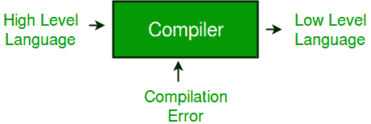
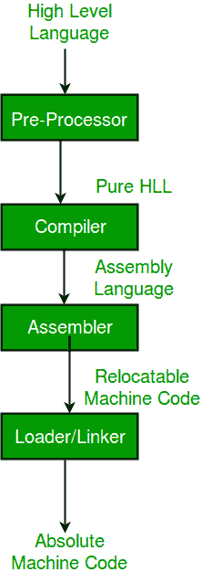
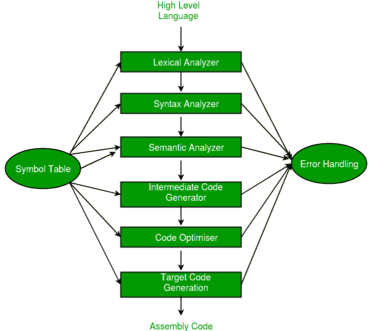

# 编译器设计介绍

> 原文:[https://www . geesforgeks . org/introduction-of-compiler-design/](https://www.geeksforgeeks.org/introduction-of-compiler-design/)

**编译器**是将高级语言(源语言)编写的程序转换为低级语言(对象/目标/机器语言)的软件。

*   **在机器‘A’上运行并为另一台机器‘B’产生代码的交叉编译器**。它能够为运行编译器的平台以外的平台创建代码。
*   **源到源编译器**或 transcompiler 或 transpiler 是一种将一种编程语言编写的源代码翻译成另一种编程语言源代码的编译器。

**语言处理系统(使用编译器)–**
我们知道计算机是软件和硬件的逻辑组合。硬件懂一门语言，这对于我们来说很难掌握，因此，我们倾向于用高级语言编写程序，这对于我们理解和保持思想来说要简单得多。现在，这些程序经历了一系列的转换，因此它们可以很容易地被机器使用。这就是语言过程系统派上用场的地方。

*   **高级语言–**如果一个程序包含#define 或#include 指令，如#include 或#define，则称之为 HLL。它们离人类更近，但离机器更远。这些(#)标记称为预处理器指令。他们指导预处理器做什么。
*   **预处理器–**预处理器通过包含称为文件包含的文件以及使用宏扩展的所有#define 指令来移除所有#include 指令。它执行文件包含、扩充、宏处理等。
*   **汇编语言–**既不是二进制形式，也不是高级。它是一种中间状态，是机器指令和执行所需的一些其他有用数据的组合。
*   **汇编器–**对于每个平台(硬件+操作系统)，我们都将有一个汇编器。它们不是通用的，因为每个平台都有一个。汇编程序的输出称为目标文件。它把汇编语言翻译成机器代码。
*   **解释器–**解释器将高级语言转换为低级机器语言，就像编译器一样。但是它们读取输入的方式不同。编译器一次性读取输入，进行处理，并执行源代码，而解释器则逐行执行相同的操作。编译器扫描整个程序，并将其作为一个整体翻译成机器代码，而解释器一次翻译一条程序语句。解释程序通常比编译程序慢。
*   **可重定位机器码–**可以在任意点加载，可以运行。程序内的地址将与程序运动相配合。
*   **Loader/Linker–**它将可重定位代码转换为绝对代码，并尝试运行程序，导致程序运行或出现错误消息(有时两种情况都可能发生)。链接器将各种目标文件加载到一个文件中，使其可执行。然后加载器将其加载到内存中并执行。

**编译器的阶段–**
编译有两个主要阶段，这两个阶段又有许多部分。它们中的每一个都从上一级的输出中获取输入，并以协调的方式工作。

**分析阶段–**从给定的源代码创建一个中间表示:

1.  词法分析程序
2.  语法分析程序
3.  语义分析程序
4.  中间代码生成器

词法分析器将程序分成“标记”，语法分析器使用语言的语法识别程序中的“句子”，语义分析器检查每个构造的静态语义。中间代码生成器生成“抽象”代码。
**合成阶段–**等效目标程序由中间表示创建。它有两个部分:

1.  代码优化器
2.  编码发生器

代码优化器优化抽象代码，最终的代码生成器将抽象的中间代码翻译成特定的机器指令。

**GATE CS 角题**

练习下列问题将帮助你测试你的知识。所有的问题在前几年的 GATE 考试或 GATE 模拟考试中都被问过。强烈建议你练习一下。

1.  [GATE CS 2011，问题 1](https://www.geeksforgeeks.org/gate-gate-cs-2011-question-1/)
2.  [GATE CS 2011，第 19 题](https://www.geeksforgeeks.org/gate-gate-cs-2011-question-19/)
3.  [GATE CS 2009，问题 17](https://www.geeksforgeeks.org/gate-gate-cs-2009-question-17/)
4.  [GATE CS 1998，问题 27](https://www.geeksforgeeks.org/aptitude-gate-cs-1998-question-27/)
5.  [GATE CS 2008，问题 85](https://www.geeksforgeeks.org/gate-gate-cs-2008-question-11/)
6.  [GATE CS 1997，问题 8](https://www.geeksforgeeks.org/gate-gate-cs-1997-question-8/)
7.  [GATE CS 2014(第三集)，第 65 题](https://www.geeksforgeeks.org/gate-gate-cs-2014-set-3-question-27/)
8.  [GATE CS 2015(第 2 集)，第 29 题](https://www.geeksforgeeks.org/gate-gate-cs-2015-set-2-question-29/)

**参考资料–**
[编译简介–](https://viden.io/knowledge/488/attachments/2376?name=viden-clip-K467-introduction+to+compiling.pdf)
[幻灯片共享](https://www.slideshare.net/IffatAnjum/lecture-01-introduction-to-compiler)