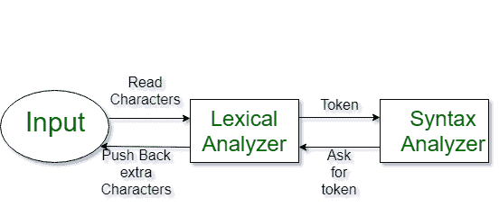
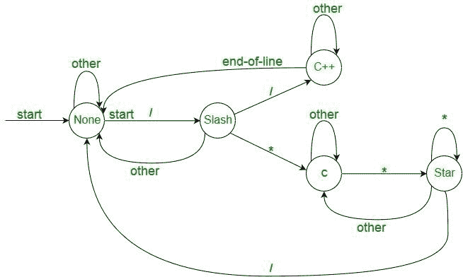
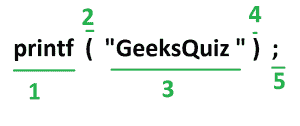

# 词汇分析介绍

> 原文:[https://www . geesforgeks . org/词汇分析介绍/](https://www.geeksforgeeks.org/introduction-of-lexical-analysis/)

词法分析是编译器的第一阶段，也称为扫描器。它将高级输入程序转换为一系列**标记**。

*   词汇分析可以用[确定性有限自动机](https://www.geeksforgeeks.org/introduction-of-finite-automata/)来实现。
*   输出是发送给解析器进行语法分析的一系列标记



**什么是代币？**
词汇标记是一系列字符，在编程语言的语法中可以作为一个单元来对待。

**代币示例:**

*   键入令牌(id、数字、实数、。。。)
*   标点符号(IF，void，return，。。。)
*   字母标记(关键词)

```
Keywords; Examples-for, while, if etc.
Identifier; Examples-Variable name, function name, etc.
Operators; Examples '+', '++', '-' etc.
Separators; Examples ',' ';' etc
```

**非令牌示例:**

*   注释、预处理器指令、宏、空格、制表符、换行符等。

**Lexeme** :由一个模式匹配的字符序列形成
对应的标记或包含单个标记的输入字符序列称为 Lexeme。例如-“float”、“abs_zero_Kelvin”、“=”、“-”、“273”、“；”。

**词法分析器如何工作 [](https://media.geeksforgeeks.org/wp-content/cdn-uploads/gq/2015/10/la.png)** 
1。令牌化，即将程序分成有效的令牌。
2。删除空白字符。
3。删除评论。
4。它还通过提供行号和列号来帮助生成错误消息。



*   The lexical analyzer identifies the error with the help of the automation machine and the grammar of the given language on which it is based like C, C++, and gives row number and column number of the error.

    假设我们通过词法分析器传递一条语句–

    **a = b+ c**；它将生成如下所示的令牌序列:

    **id = id+id**；其中每个 id 指的是它在符号表中引用所有细节的变量

    例如，考虑一下这个程序

    ```
    int main()
    {
      // 2 variables
      int a, b;
      a = 10;
     return 0;
    }
    ```

    所有有效的令牌是:

    ```
    'int'  'main'  '('  ')'  '{'  'int'  'a' ','  'b'  ';'
     'a'  '='  '10'  ';' 'return'  '0'  ';'  '}'
    ```

    以上是有效的令牌。
    你可以观察到我们省略了注释。

    作为另一个例子，考虑下面的 printf 语句。
    [](https://media.geeksforgeeks.org/wp-content/cdn-uploads/gq/2015/07/token.png) 
    在这个 printf 语句中有 5 个有效令牌。
    **练习 1:**
    计算代币数量:

    ```
    int main()
    {
      int a = 10, b = 20;
      printf("sum is :%d",a+b);
      return 0;
    }
    Answer: Total number of token: 27.
    ```

    **练习 2:**

    计算令牌数:

    int max(int I)；

    *   词法分析器首先读取 **int** ，发现它是有效的，并将其作为标记接受
    *   **max** 被其读取，读取 **(** 后发现为有效函数名
    *   **int** 也是一个令牌，然后再 **i** 作为另一个令牌，最后**；**

    ```
     Answer:  Total number of tokens 7:     
    int, max, ( ,int, i, ), ;
    ```

    以下是前一年关于词汇分析的 GATE 问题。

    [https://www.geeksforgeeks.org/lexical-analysis-gq/](https://www.geeksforgeeks.org/lexical-analysis-gq/)
    如果你发现任何不正确的地方，或者你想分享更多关于上面讨论的话题的信息，请写评论