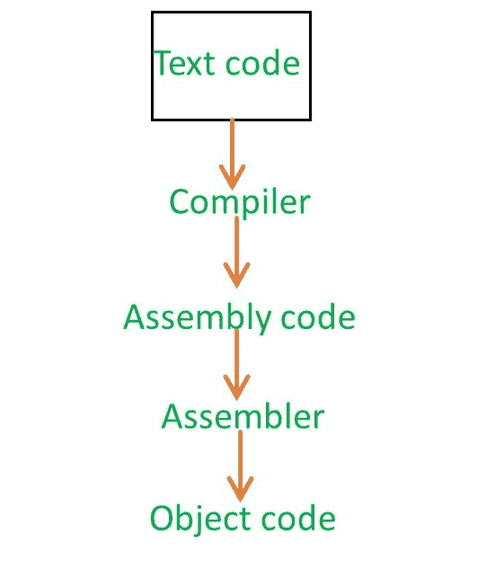
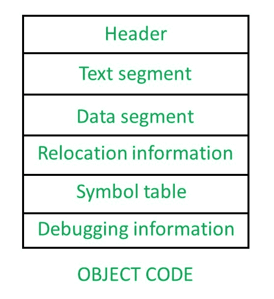
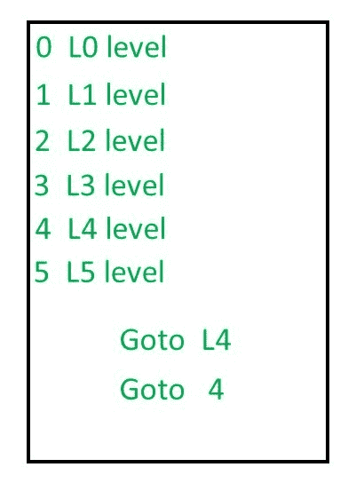

# 编译器设计中的目标代码介绍

> 原文:[https://www . geesforgeks . org/编译器设计中的目标代码介绍/](https://www.geeksforgeeks.org/introduction-of-object-code-in-compiler-design/)

让我们假设，你有一个 C 程序，然后你把 C 程序交给编译器，编译器会以汇编代码的形式产生输出。现在，汇编语言代码将提供给汇编程序，汇编程序将产生一些代码。这就是所谓的**目标代码**。

但是，当你编译一个程序时，你不会同时使用编译器和汇编器。你只要把程序交给编译器，编译器就会给你可直接执行的代码。编译器实际上是与加载器和链接器一起组合在汇编程序内部的。所以所有的模块都保存在编译软件本身中。所以当你调用 gcc 时，你实际上不仅仅是在调用编译器，你在调用编译器，然后是汇编器，然后是链接器和加载器。

一旦你调用了编译器，你的目标代码就会出现在硬盘上。该目标代码包含不同部分–

*   **Header –**
    The header will say what are the various parts present in this object code and then point that parts. So header will say where the text segment is going to start and a pointer to it and where the data segment going to start and it say where the relocation information and symbol information there.

    它只不过像一个索引，就像你有一本教科书，在那里一个索引页会包含每个题目的页码。同样，标题会告诉你，每一个信息出现的宫殿是什么。因此以后对于其他软件来说，直接进入这些部分将是有用的。

*   **文本段–**
    无非是指令集。
*   **数据段–**
    数据段将包含您使用过的任何数据。例如，您可能使用了某种约束，那么它将出现在数据段中。
*   **Relocation Information –**
    Whenever you try to write a program, we generally use symbol to specify anything. Let us assume you have instruction 1, instruction 2, instruction 3, instruction 4,….
    

    现在如果你在某个地方说 Goto L4(即使你不用高级语言写 Goto 语句，编译器的输出也会写)，那么那个代码就会转换成目标代码，L4 就会被 Goto 4 代替。现在 L4 级的 Goto 4 可以正常工作，只要程序从地址 0 开始加载。但是在大多数情况下，内存的初始部分将专用于操作系统。即使它不是专用于操作系统，也可能是已经在地址 0 运行的其他进程。所以，当你将程序加载到内存中时，意味着如果程序必须加载到主内存中，它可能会加载到任何地方。假设 1000 是新的起始地址，那么所有的地址都要改变，也就是所谓的**重新分配**。
    T3】

    原始地址被称为**可重定位地址**，我们将程序加载到主内存后得到的最终地址被称为**绝对地址**。

    ### 符号表–

    它包含你程序中的每个符号。例如，int a，b，c 那么，a，b，c 是符号，它将显示你的程序包含哪些变量。

    ### 调试信息–

    这将有助于发现变量是如何不断变化的。

    **GATE CS 角题**

    练习下列问题将帮助你测试你的知识。所有的问题在前几年的 GATE 考试或 GATE 模拟考试中都被问过。强烈建议你练习一下。

    [1。GATE-CS-2001 |问题 17](https://www.geeksforgeeks.org/gate-gate-cs-2001-question-17/)

    本文由 [**萨米特·曼德尔**](https://auth.geeksforgeeks.org/profile.php?user=Samit Mandal&list=practice) 供稿。如果你喜欢 GeeksforGeeks 并想投稿，你也可以使用[write.geeksforgeeks.org](https://write.geeksforgeeks.org)写一篇文章或者把你的文章邮寄到 review-team@geeksforgeeks.org。看到你的文章出现在极客博客主页上，帮助其他极客。

    如果你发现任何不正确的地方，或者你想分享更多关于上面讨论的话题的信息，请写评论。