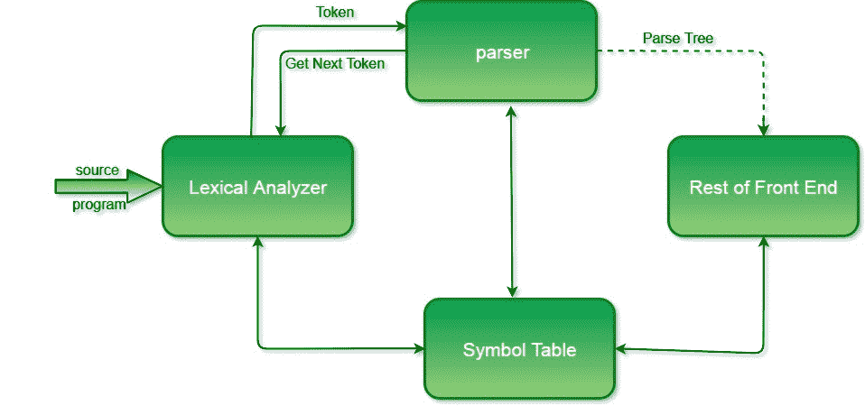
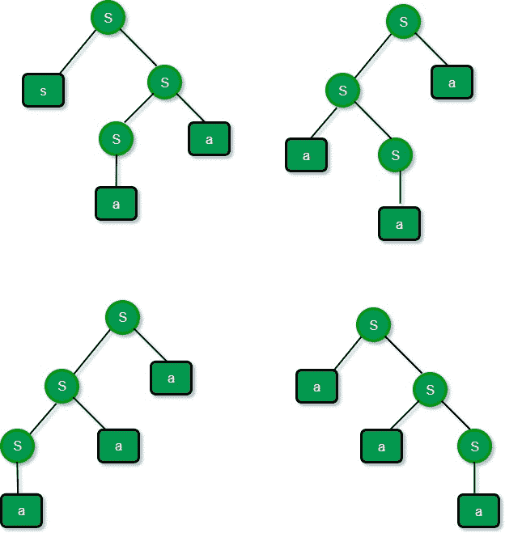
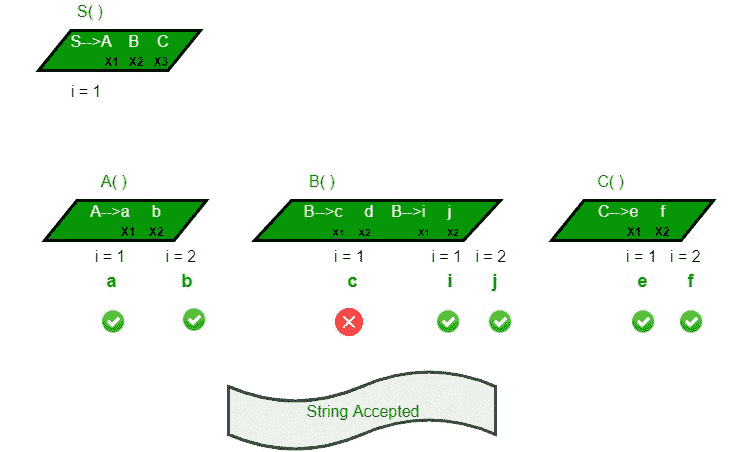
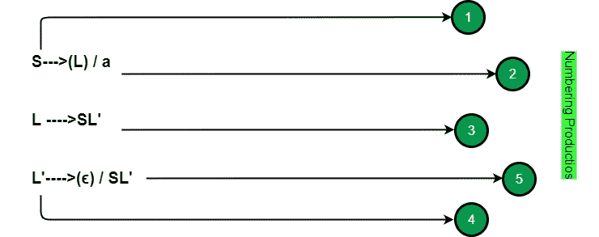
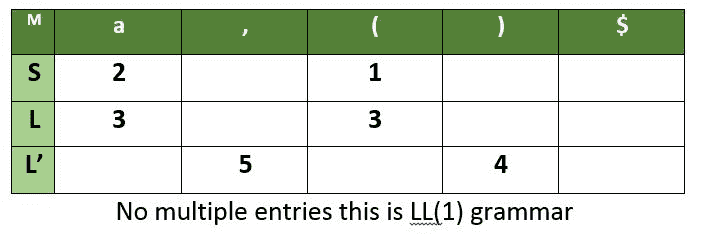
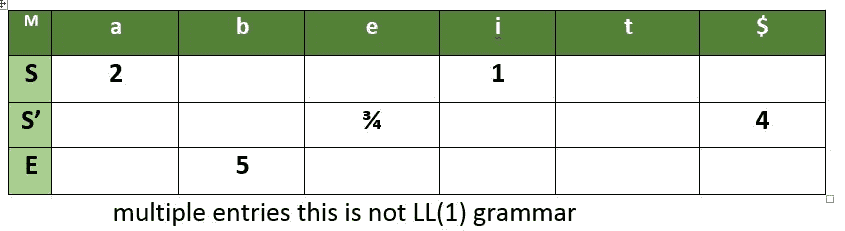
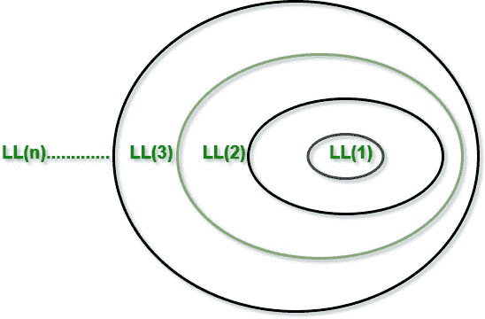

# 解析|集合 1(介绍、歧义和解析器)

> 原文:[https://www . geeksforgeeks . org/解析介绍-歧义和解析器-set-1/](https://www.geeksforgeeks.org/introduction-of-parsing-ambiguity-and-parsers-set-1/)

在本文中，我们将研究各种类型的解析。从 GATE 的角度来看，这是编译器中最重要的主题之一。将从 GATE 问题解决的角度解释各种解析器的工作。
**先决条件**——语法、语法分析树、歧义的基础知识。

## 解析器的角色:

在语法分析阶段，编译器验证词法分析器生成的标记是否根据语言的语法规则进行了分组。这是由解析器完成的。解析器从词法分析器获得一个标记字符串，并验证该字符串是否可以作为源语言的语法。它检测并报告任何语法错误，并生成一个解析树，从中可以生成中间代码。



在讨论解析器的类型之前，我们将讨论理解解析所需的一些重要内容。

**上下文无关语法** :
编程语言的语法是由上下文无关语法(CFG)描述的。CFG 由一组终端、一组非终端、一个开始符号和一组产品组成。
符号–？？？哪里？是一个是单变量【V】
？？(电压+温度)*

**歧义**
为某个句子生成多个解析树的语法被称为歧义。
Eg-考虑一个语法
S - > aS | Sa | a
现在对于字符串 aaa，我们将有 4 个解析树，因此有歧义



更多信息请参考[quiz.geeksforgeeks.org/ambiguous-grammar/](https://www.geeksforgeeks.org/ambiguous-grammar/)

**移除左递归:**
如果一个语法有一个非终结(变量)S，从而有一个派生
S - > Sα | β
其中α？(V+T)*和β？(V+T)*(不以 S 开头的终端和非终端序列)
由于左递归的存在，一些自上而下的解析器进入无限循环，因此我们必须消除左递归。
让产品为 A->Aα<sub>1</sub>| Aα<sub>2</sub>| Aα<sub>3</sub>|…..| aα<sub>m</sub>|β<sub>1</sub>|β<sub>2</sub>|…。|β<sub>n</sub>T21【无βi】以 A 开头，然后我们用
A->β<sub>1</sub>A“|β<sub>2</sub>A”|…..|β<sub>n</sub>A '
A '->α<sub>1</sub>A ' |α<sub>2</sub>A ' |α<sub>3</sub>A ' |…..|α<sub>m</sub>A“|ε
非终结符 A 生成与之前相同的字符串，但不再是左递归的。
我们来看一些例子，以便更好地理解

![ \\ Example 1: \\ \\S\rightarrow S\overset{\alpha _{1}}{ab} \hspace{2 mm}/\hspace{2 mm} S\overset{\alpha _{2}}{cd} \hspace{2 mm}/ \hspace{2 mm}S\overset{\alpha _{3}}{ef}\hspace{2 mm} /\hspace{2 mm} \overset{\beta_{1}}{g}\hspace{2 mm}/\hspace{2 mm}\overset{\beta_{2}}{h}\\ \\ S\rightarrow gS'/hS'\\ \\ S'\rightarrow \epsilon /abS'/cdS'/efS' \\ \\ Example 2:\\ \\ S\rightarrow (L)/a \hspace{2 cm} No\hspace{2 mm} left\hspace{2 mm} Recursion\\ \\ L\rightarrow L,S/S \hspace{2 cm} left\hspace{2 mm} Recursion\\ \\ L\rightarrow Sl' \\ \\ L'\rightarrow \epsilon/ SL' \\   ](img/67f79e78fd2e4b04d5f2582a9755fc24.png "Rendered by QuickLaTeX.com")

**移除左因子:**
当语法的形式为–
A->αβ<sub>1</sub>|αβ<sub>2</sub>|αβ<sub>3</sub>|……|αβ<sub>n</sub>|γ时，即产品从相同的终端(或终端组)开始。在看到输入α时，我们无法立即判断选择哪个产品来扩展 a。
左因式分解是一种语法转换，对于生成适用于预测或自顶向下解析的语法非常有用。当两个备选 A-制作之间的选择不明确时，我们可以重写制作，以推迟决定，直到看到足够的输入来做出正确的选择。
对于语法 A->αβ<sub>1</sub>|αβ<sub>2</sub>|αβ<sub>3</sub>|……|αβ<sub>n</sub>|γ
等效的左因子语法将是–
A->αA | |γ
A '->β<sub>1</sub>|β<sub>2</sub>|β【T29


从给定的语法中派生字符串的过程称为派生(解析)。
根据推导的方式，我们有两种解析器:-

1.  自顶向下解析器
2.  自底向上解析器

我们将从 GATE 的角度研究解析器。

**自顶向下解析器**
自顶向下解析试图从根到叶构建解析树。自顶向下的解析器将从开始符号开始，并继续处理字符串。它遵循最左边的推导。在最左派生词中，每个句子最左边的非终结词总是被选择。

**递归下降解析**

```
S()
{     Choose any S production, S ->X1X2…..Xk;
      for (i = 1 to k)
      {
          If ( Xi is a non-terminal)
          Call procedure Xi();
          else if ( Xi equals the current input, increment input)
          Else /* error has occurred, backtrack and try another possibility */
      }
}
```

让我们用一个例子来更好地理解它




递归下降解析程序由一组程序组成，每个非终结符一个。执行从开始符号的过程开始，如果过程体扫描整个输入字符串，该符号将停止。

**非递归预测解析:**
这种类型的解析不需要回溯。可以为 LL(1)语法构建预测解析器，第一个‘L’代表从左到右扫描输入，第二个‘L’代表最左边的派生，而‘1’代表在每个步骤使用一个输入符号前瞻来做出解析动作决策。
在继续学习 LL(1)解析器之前，请通过 FIRST 和 FOLLOW
[https://www.geeksforgeeks.org/first-set-in-syntax-analysis/](https://www.geeksforgeeks.org/first-set-in-syntax-analysis/)
[https://www . geeksforgeeks . org/FOLLOW-set-in-syntax-analysis/](https://www.geeksforgeeks.org/follow-set-in-syntax-analysis/)

**构建 LL(1)预测解析表**

对于每个产品 A -> α，重复以下步骤–
为 FIRST(α)
中的所有 b 在 M[A，b]下添加 A - > α如果 FIRST(α)包含ε，则为 FOLLOW(A)中的所有 c 在 M[A，c]下添加 A - > α。
解析表的大小=(终端数量+1)* #个变量

例如–考虑语法
S->(L)| a
L->SL '
L '->ε| SL '





对于任何语法，如果 M 有多个条目，那么它就不是 LL(1)语法
Eg–
S->iets/a
S '->eS/ε
E->b



重要注意事项

```
      1\. If a grammar contain left factoring then it can not be LL(1)
        Eg - S -> aS | a      ---- both productions go in a
      2\. If a grammar contain left recursion it can not be LL(1)
        Eg - S -> Sa | b 
                S -> Sa goes to FIRST(S) = b
                S -> b goes to b, thus b has 2 entries hence not LL(1)
      3\. If a grammar is ambiguous then it can not be LL(1)
      4\. Every regular grammar need not be LL(1) because 
         regular grammar may contain left factoring, left recursion or ambiguity. 
```



我们将在下一篇文章中讨论自底向上解析器( [Set 2](https://www.geeksforgeeks.org/parsing-set-2-bottom-up-or-shift-reduce-parsers/) )。

本文由**帕鲁尔·夏尔马**T2 供稿