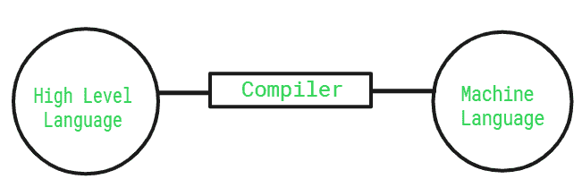

# 编译器简介

> 原文:[https://www.geeksforgeeks.org/introduction-to-compilers/](https://www.geeksforgeeks.org/introduction-to-compilers/)

编译器是一种软件，通常采用高级语言(如 C++和 Java)代码作为输入，并立即将输入转换为低级语言。如果输入代码不符合其语言规则，它会列出所有错误。这个过程比解释器快得多，但是在一个程序中一起调试所有的错误变得很困难。

编译器是将高级语言的指令翻译成机器级语言的翻译程序。输入编译器的程序称为**源程序**。这个程序现在被编译器转换成机器级语言，称为**目标代码。**

**有不同的编译器:**

*   **交叉编译器–**编译后的程序可以在 CPU 或操作系统与编译器运行的计算机不同的计算机上运行。

*   **Bootstrap 编译器–**用它打算编译的语言编写的编译器。

*   **反编译程序–**从低级语言翻译到高级语言的编译器。

*   **trans compiler–**翻译高级语言的编译器。

一个编译器只能翻译那些用它所代表的语言编写的源程序。每种高级编程语言都需要单独的编译器进行转换。

例如， **FORTRAN** 编译器能够翻译成 **FORTRAN** 程序。一个计算机系统可能有一个以上的编译器为一种以上的高级语言工作。

根据计算机语言使用最多的编译器–

*   **C**–Turbo C、微型 C 编译器、GCC、Clang、便携 C 编译器

*   **C++**—gcc、Clang、Dev C++、英特尔 c++、代码块

*   **JAVA**–IntelliJ IDEA、Eclipse IDE、NetBeans、BlueJ、JDeveloper

*   **科特林**–intellij idea，Eclipse IDE

*   **python**–cpython、JPython、Wing、Spyder

*   **JavaScript**–WebStorm、Atom IDE、Visual Studio Code、Komodo Edit