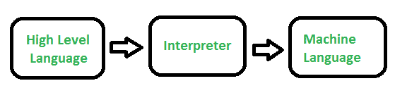

# 口译员介绍

> 原文:[https://www.geeksforgeeks.org/introduction-to-interpreters/](https://www.geeksforgeeks.org/introduction-to-interpreters/)

先决条件–[汇编器、编译器和解释器](https://www.geeksforgeeks.org/language-processors-assembler-compiler-and-interpreter/)
所有高级语言都需要转换为机器码，以便计算机在接受所需输入后能够理解程序。

除了编译器和汇编器之外，将高级指令逐行转换成机器语言的软件称为**解释器**。如果在任何一行发现错误，执行将停止，直到它被纠正。这种纠正错误的过程更容易，因为它会产生一行一行的错误，但是程序需要更多的时间才能成功执行。口译员最早是在 1952 年使用的，目的是在当时计算机的限制下简化编程。

它将源代码翻译成某种有效的中间表示，并立即执行。

源程序被提前编译并存储为独立于机器的代码，然后在运行时链接并由解释器执行。解释器通常用于微型计算机。它帮助程序员找出错误，并在控制转移到下一条语句之前纠正它们。

解释器系统执行高级程序描述的动作。对于解释程序，每次运行程序都需要源代码。解释程序比编译程序运行得慢。

**自解释器**是一个编程语言解释器，它是用一种可以自我解释的语言编写的。
举例- **BASIC** 解释器用 **BASIC** 编写。它们与自宿主编译器相关。有些语言有优雅的自我解释器，比如 Lisp 和 Prolog。

**解释器的需求:**
解释器的第一个也是最重要的需求是将源代码从高级语言翻译成机器语言。然而，为了这个目的，编译器也满足这个条件。

编译器是用高级语言开发程序的非常强大的工具。然而，编译器有几个缺点。如果源代码很大，那么编译源代码可能需要几个小时，这将大大增加编译时间。在这里，解释器发挥了它的作用。他们可以缩短这个巨大的编译时间。它们被设计成一次翻译一条指令并立即执行。

**译员的优势和劣势:**

*   **解释器**的优势在于逐行执行，帮助用户轻松发现错误。
*   **解释器**的缺点是执行成功的时间比编译器多。

**口译员申请:**

*   在命令语言中执行的每个操作符通常都是复杂例程的调用，例如编辑器或编译器，因此它们经常被用于命令语言和粘合语言。
*   当预期的体系结构不可用时，通常使用虚拟化。
*   沙盒
*   自修改代码可以很容易地用解释语言实现。
*   用于运行计算机软件的仿真器，该软件是为更现代设备上过时和不可用的硬件编写的。

**使用解释器的编程语言的一些例子**有植森、Ruby、Perl、PHP 和 Matlab。

**根据计算机语言的顶级口译员–**

*   植物素-植物素，PyPy，无叠层植物素，铁植物素
*   红宝石磁共振成像
*   JAVA- HotSpot、OpenJ9、JRockIt
*   科特林-雅子