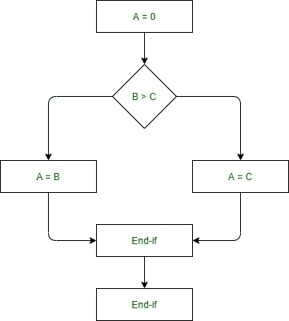
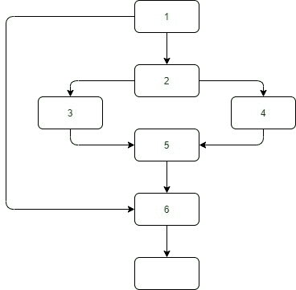
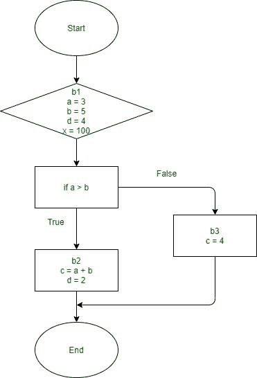

# 一个反向数据流问题的迭代算法

> 原文:[https://www . geeksforgeeks . org/向后数据流问题迭代算法/](https://www.geeksforgeeks.org/iterative-algorithm-for-a-backward-data-flow-problem/)

**简介:**
写这篇文章的原因是为了告诉你一套近似迭代的规则，用于后向统计浮点问题。在开始之前，您必须了解一些与统计浮动分析相关的术语。

[**数据流分析**](https://www.geeksforgeeks.org/data-flow-analysis-compiler/) **:**
这是一种收集关于在计算机程序中不同点计算的可能值集的信息的技术。
是对事物流图顶部统计漂移的评价，即确定程序中关于统计定义和使用的记录的评价。在这个评估的帮助下，可以进行优化。一般来说，它的方式，其中的价值已经计算使用统计流量评估。带有漂移属性的统计数据表示可用于优化的记录。

[**【控制流程图】**](https://www.geeksforgeeks.org/software-engineering-control-flow-graph-cfg/) **:**
它用于决定分配给变量的特定费用可能传播到的软件元素。
控制流图(CFG)是在包或应用程序的整个执行过程中管理计算流的图示。除了编译器应用程序之外，控制流图经常被用于静态评估，因为它们能够适当地表示应用程序单元内部的流。管理随波逐流一开始是通过法兰西斯·E·艾伦的方式演变而来的。

**示例–**

```
if  A = 10 then
  if B > C
     A = B
  else A = C
  endif
  endif
print A, B, C 
```

**上例流程图–**



[**以上示例的控制流程图**](https://www.geeksforgeeks.org/software-engineering-control-flow-graph-cfg/)**–**



**天真的方法(基尔达尔的方法)–**
对包进行数据飘散评估的最简单方式是为控制飘散图的每个节点安装数据飘散方程，并一次又一次地清除它们，在每个节点计算输入的国内输出，直到整个设备稳定下来，即达到一个固定点。

**一个迭代算法–**
一套迭代规则是最大限度不寻常的地方方式来解决事实随波逐流的评估方程。在这套规则中，我们特别有国家，首先一个是国内的，另一个是国外的。这组规则开始于每个块的输入的近似值，然后通过利用输入状态的开关能力来计算。通过使用 be 部分操作的方式，状态是最新的。重复后面的步骤，直到我们达到固定点:状态不再改变的场景。

**上述算法的效率–**
该算法求解数据流方程的效率受访问本地节点的顺序影响，并且还依赖于数据流方程是否用于在 CFG(管理流图)上的前向或后向数据流评估。

修正数据浮动方程的几个生成顺序如下–

*   **随机顺序–**
    在这个新的发布顺序中，并不总是意识到数据飘散方程是否解决了向前或向后的数据飘散问题。因此，与专门的新发布订单相比，整体性能相当糟糕。
*   [](https://www.geeksforgeeks.org/tree-traversals-inorder-preorder-and-postorder/)****–**
    这个新的发布顺序针对的是后向数据——随波逐流的问题。在任何情况下，节点都会被访问，它的后续节点也会被访问，并使用深度优先策略执行。**
*   **[**逆序后置**](https://www.geeksforgeeks.org/reverse-level-order-traversal/)**–**
    这个代序是为了转发数据——随波逐流的问题。该节点被访问的时间早于其后继节点被访问的时间，此外，后继节点是通过返回边的方式到达的。**

****逆向分析–**
这是一种借助想象来研究随机算法的方法，就像它在时间上向后运行一样，从输出到输入。**

****示例–**
**块的状态–**
块开始时包含的变量集，在执行传递函数和计算实际包含值之前，它最初包含块中包含的所有变量。**

****块的非状态–**
包含在块末尾的一组变量，由块的后继状态的并集来计算。**

```
Initial code -
b1: a = 3;
b = 5;
   d = 4;
   x = 100;
   if a > b then
b2:    c = a + b;
      d = 2;
b3: endif
   c = 4;
   return b * d + c;
```

****

```
**Backward data analysis -**

// in: {}
b1: a = 3;
    b = 5;
    d = 4;
    x = 100; //x is never being used later thus not in the out set {a,b,d}
   if a > b then
// out:     //union of all (in) successors of b1 => b2: , and b3: 

//  in: {a,b}
b2: c = a + b;
    d = 2;
//  out: {b,d}

//  in: {b,d}
b3: endif
    c = 4;
    return b * d + c;
//  out:{}
```

**从上面的例子中，我们可以观察到以下三点**

*   **首先，b3 的 in 状态只包含 b 和 d，但是 c 已经被写入。**
*   **其次，b1 的外族是 b2 和 b3 的内族的联盟。**
*   **最后一点是 b2 中 c 的定义可以去掉，因为 c 不是紧接在语句之后的。**

****进度表–****

<figure class="table">

| **加工** | **输出状态** | **旧状态** | **新状态** | **工作列表** |
| --- | --- | --- | --- | --- |
| b3 | {} | {} | {b，d} | (b1，b2) |
| b1 | {b，d} | {} | {} | (b2) |
| b2 | {b，d} | {} | {a，b} | (b1) |
| b1 | {a，b，d} | {} | {} | () |

****工作列表–**
这是一个仍然需要处理的块的列表。**

```
**Note -**
The b1 changed into entered withinside the listing earlier than b2, which compelled processing b1 
twice (b1 changed into re-entered as
 the predecessor of b2).Inserting b2 earlier than b1 could 
have allowed in advance completion.
```

****要记住的点–****

*   **用空集合初始化是一个乐观的初始化，因为所有变量都是从死开始的。**
*   **从一个新版本到下一个版本，外州不能减少，即使外州可能比内州小。**
*   **王国内部因为空集而开始启动，它能够在同样的迭代中最简单的发展。**

</figure>