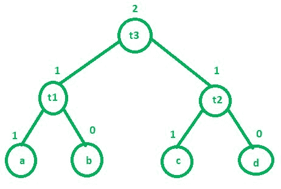

# 编译器设计中的标注算法

> 原文:[https://www . geesforgeks . org/labling-算法在编译器中-design/](https://www.geeksforgeeks.org/labeling-algorithm-in-compiler-design/)

标记算法由编译器在代码生成阶段使用。基本上，这个算法是用来找出一个程序需要多少个寄存器来完成它的执行。标记算法以自下而上的方式工作。我们将首先标记子节点，然后标记内部节点。标记算法的规则是:

1.  **如果‘n’是叶节点–**
    *   **a.** 如果‘n’是一个左子，那么它的值是 1。
    *   **b.** 如果‘n’是一个右子，那么它的值是 0。
2.  **如果‘n’是内部节点–**
    假设 L1 和 L2 分别是内部节点的左右子节点。
    *   **a.** 如果 L1 == L2，那么‘n’的值是 L1 + 1 或 L2 + 1
    *   **b.** 如果 L1！= L2，则“n”的值为 MAX(L1，L2)

**例:**
考虑以下三个地址码:

```
t1 = a + b
t2 = c + d
t3 = t1 + t2 
```



以上三个地址码最多需要 2 个寄存器才能完成执行。

有一个名为 getregister()的函数，编译器使用它来决定结果将被存储在哪里。该功能有以下 4 种情况:

1.  如果有一个寄存器 R 没有保存多个值，那么我们可以使用这个寄存器来存储结果的值(在上面的例子中，我们可以将 t3 存储在 R 中，前提是 R 中的当前值没有在程序中的任何地方使用。).
2.  如果第一个条件不满足，那么编译器将搜索任何空寄存器来存储我们的结果值(t3)。
3.  如果没有空寄存器，则将任何寄存器的内容交换到存储器中，并将结果(t3)存储在该寄存器中，前提是这些内容没有任何后续用途。
4.  如果这三个条件都不成立，则将结果存储在任何空闲的内存位置。