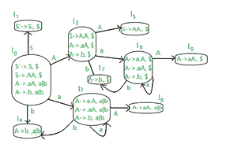
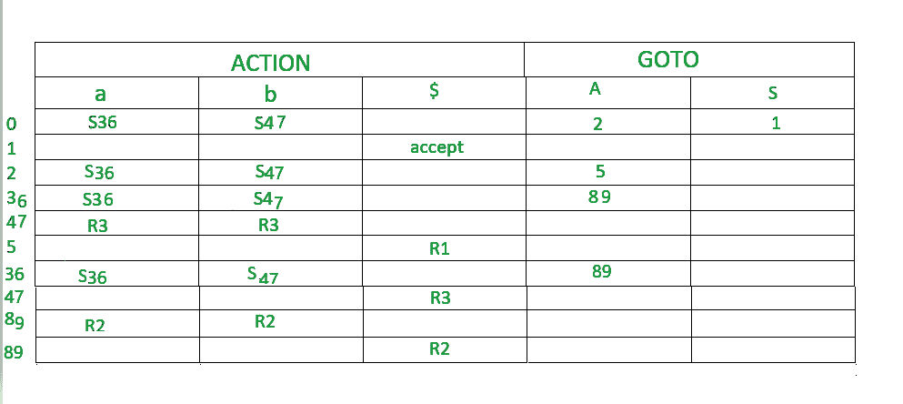
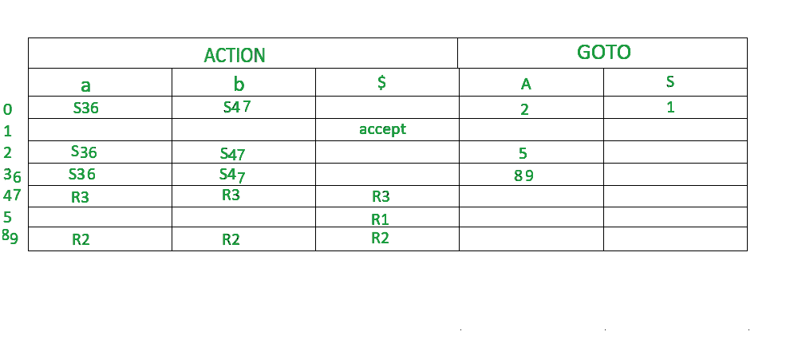

# LALR 解析器(带示例)

> 原文:[https://www.geeksforgeeks.org/lalr-parser-with-examples/](https://www.geeksforgeeks.org/lalr-parser-with-examples/)

**LALR 解析器:**
LALR 解析器是前瞻 LR 解析器。它是最强大的语法分析器，可以处理大量的语法。与其他解析表相比，CLR 解析表的大小相当大。LALR 缩小了这张桌子的尺寸。LALR 的工作原理类似于 CLR。唯一不同的是，它将 CLR 解析表的相似状态组合成一个状态。
一般语法变成【A->∧。b、a ]
凡 A->∧。b 是生产，a 是终端或右端标记$
LR(1)项=LR(0)项+向前看

**如何在制作中加入前瞻？**

**案例 1–**

```
A->∝.BC, a
```

假设这是第 0 次生产。现在，自从“.”先于 B，所以我们也要写 B 的作品。

```
B->.D [1st production]
```

假设这是 B 的作品。本次生产的前景如下-我们查看之前的生产，即–第 0 次生产。无论 B 之后是什么，我们都会找到 FIRST(该值)，这是 FIRST 生产的前瞻。所以，在第 0 次生产中，在 B 之后，C 在那里。假设第一个(C)=d，那么第一个生产成为。

```
B->.D, d
```

**案例 2–**
如果第 0 部作品是这样的，

```
A->∝.B, a
```

在这里，我们可以看到 b 之后什么都没有，所以第 0 次生产的前瞻将是第 1 次生产的前瞻。ie-

```
B->.D, a
```

**案例 3–**
假设生产 A- > a|b

```
A->a,$ [0th production]
A->b,$ [1st production]
```

这里，第一个产品是前一个产品的一部分，因此前瞻将与其前一个产品相同。

**构建 LALR 解析表的步骤:**

1.  写作扩充语法
2.  LR(1)待发现项目的集合
3.  定义 2 个函数:转到 LALR 解析表中的[终端列表]和动作[非终端列表]

**示例**
**为给定的上下文无关语法构建 CLR 解析表**

```
S-->AA    
A-->aA|b
```

**解决方案:**

**STEP1-** 查找扩充语法
给定语法的扩充语法是:-

```
S'-->.S ,$   [0th production]    
S-->.AA ,$ [1st production]    
A-->.aA ,a|b [2nd production]      
A-->.b ,a|b [3rd production]
```

让我们将前瞻规则应用于上述产品。

*   最初的预期总是 100 美元
*   现在，第一部作品因为“.”而诞生在第 0 次生产“S”之前。“S”之后没有任何内容，因此第 0 个生产的前瞻将是第 1 个生产的前瞻。即:S–>。AA，$
*   现在，第二部作品因“.”而产生在第一部作品的 A 之前。
    A 后面有 A。所以，FIRST(A)是 A，b。因此，第二个作品的前瞻变成了 a|b
*   现在，第三个产品是第二个产品的一部分。所以，未来的前景将是一样的。

**step 2–**查找 LR(0)物品集合
下图为 LR(0)物品集合。我们会一件一件了解一切。



这个语法的终端是{a，b}
这个语法的非终端是{S，A}

**规则–**

1.  如果任何非终端有“.”在它之前，我们必须写下它所有的作品并加上“.”在每次生产之前。
2.  从一个状态到下一个状态的“.”向右移动一个位置。

*   在图中，I0 由扩充语法组成。
*   木卫一什么时候去 I1 第 0 次生产的产品被转移到 S(S'->S)的右侧。这个状态就是接受状态。编译器会看到 s。因为 I1 是第 0 部作品的一部分，所以前瞻是相同的，即$
*   当“.”时，Io 转到 I2 第一部作品的重心向右移。编译器会看到。因为 I2 是第一个产品的一部分，所以前瞻是相同的，即$。
*   当“.”时，I0 转到 I3 第二部的作品被移向右边。由于 I3 是第二个产品的一部分，所以前瞻是相同的，即 a|b。
*   当“.”时，I0 转到 I4 第三次生产的位置向右移动(A->b)。编译器会看到 b。因为 I4 是第三代产品的一部分，所以前瞻是相同的，即 a|b。
*   当“.”时，I2 转到 I5 第一次生产的位置向右移动(S->AA。) .编译器会看到。由于 I5 是第一个产品的一部分，所以前瞻是相同的，即$。
*   当“.”时，I2 转到 I6 第二部的作品被移向右边。编译器会看到。由于 I6 是第二个产品的一部分，所以前瞻是相同的，即$。
*   当“.”时，I2 转到 I7 第三次生产的位置向右移动(A->b)。编译器会看到。由于 I6 是第三代产品的一部分，所以前瞻是相同的，即$。
*   当“.”时，I3 转到 I3 第二部作品的主题向右移了。编译器会看到。因为 I3 是第二部作品的一部分，所以前瞻是相同的，即 a|b。
*   当“.”时，I3 转到 I8 生产的第二部分向右移动(A->aA。) .编译器会看到。由于 I8 是第二个产品的一部分，所以前瞻是相同的，即 a|b。
*   当“.”时，I6 转到 I9 生产的第二部分向右移动(A->aA。) .编译器会看到。由于 I9 是第二个产品的一部分，所以前瞻是相同的，即$。
*   当“.”时，I6 转到 I6 第二部作品的主题向右移了。编译器会看到。由于 I6 是第二个产品的一部分，所以前瞻是相同的，即$。
*   当“.”时，I6 转到 I7 第三部作品的重心向右移(A->b)。编译器会看到 b。由于 I6 是第三代产品的一部分，所以前瞻是相同的，即$。

**STEP 3–**
定义 2 个函数:转到解析表中的【终端列表】和动作【非终端列表】。下面是 CLR 解析表


一旦我们制作了一个 CLR 解析表，我们就可以很容易地从中制作一个 LALR 解析表。

在步骤 2 的图表中，我们可以看到

*   I3 和 I6 除了长相相似之外，其他都差不多。
*   I4 和 I7 除了外观相似之外，其余都相似。
*   I8 和 I9 除了长相相似之外，其他都差不多。

在 LALR 解析表构造中，我们合并了这些相似的状态。

*   只要有 3 或 6，就变成 36(组合形式)
*   只要有 4 或 7，就变成 47(组合形式)
*   只要有 8 或 9，就使它成为 89(组合形式)

下面是 LALR 解析表。



现在我们必须删除不需要的行

*   我们可以看到，36 行有两次相同的数据，所以我们删除了 1 行。
*   我们通过组合单个 47 行中的每个值，将两个 47 行组合成一个。
*   我们通过组合单个 89 行中的每个值，将两个 89 行组合成一个。

最终的 LALR 表如下所示。

