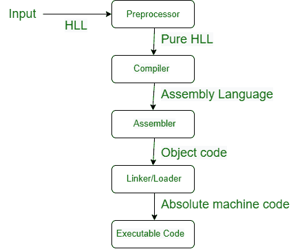
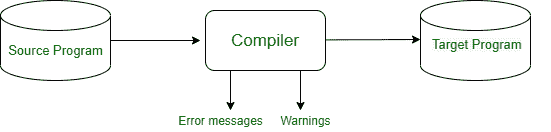

# 编译器设计中的语言处理系统

> 原文:[https://www . geesforgeks . org/language-processing-system-in-compiler-design/](https://www.geeksforgeeks.org/language-processing-system-in-compiler-design/)

**简介:**
电脑是软硬件的智能结合体。硬件只是一个机械设备，它的功能是由相关的软件来编译的。硬件将指令视为电子电荷，相当于软件编程中的二进制语言。二进制语言只有 0 和 1。为了启发，硬件代码必须以二进制格式编写，这只是一系列 0 和 1。对于计算机程序员来说，编写这样的代码是一项不方便且复杂的任务，所以我们用高级语言编写程序，这便于我们理解和记忆。然后，这些程序被输入到一系列设备和操作系统(OS)组件中，以获得机器可以使用的所需代码。这就是所谓的**语言处理系统**。

语言处理系统

**语言处理系统的组件:**
你在上图中看到有以下组件。我们一个一个来讨论。

*   [**【预处理器】**](https://www.geeksforgeeks.org/preprocessor-works-c/)**–**
    预处理器包括所有头文件，还评估一个宏(一个宏是否是一段被赋予名称的代码。每当使用该名称时，解释器或编译器都会将其替换为宏的内容。宏的目的要么是自动化序列使用的频率，要么是实现更强大的抽象)。它以源代码为输入，以修改后的源代码为输出。预处理器也称为宏赋值器，处理是可选的也就是说如果任何不支持***#的语言包括*** 和 [***宏***](https://www.geeksforgeeks.org/interesting-facts-preprocessors-c/) 处理是不需要的。

*   [**编译器**](https://www.geeksforgeeks.org/compiler-design-tutorials/)**–**
    编译器将修改后的代码作为输入，生成目标代码作为输出。

输入输出

*   [**汇编器**](https://www.geeksforgeeks.org/introduction-of-assembler/)**–**
    汇编器以目标代码为输入，产生真实可定位机器码为输出。

*   [**【链接器】**](https://www.geeksforgeeks.org/linker/)**–
    链接器或链接编辑器是一个程序，它获取一组对象(由汇编器和编译器创建)并将它们组合成一个可执行程序。** 
*   **[**加载器**](https://www.geeksforgeeks.org/difference-between-linker-and-loader/)**–
    加载器将链接的程序保存在主内存中。**** 
*   ****[**可执行代码**](https://www.geeksforgeeks.org/difference-between-source-code-and-object-code/)**–**
    它是低级和机器特定的代码和机器可以轻松理解的。一旦链接器和加载器的工作完成，目标代码最终将其转换为可执行代码。****

****[**链接器/加载器之间的区别**](https://www.geeksforgeeks.org/difference-between-linker-and-loader/) **:**
链接器和加载器之间的区别如下。****

<figure class="table">

| **左** | 装载机 |
| --- | --- |
| 链接器是库文件的一部分。 | 加载程序是操作系统的一部分。 |
| 链接器执行链接操作。 | 加载程序加载程序以供执行。 |
| 它还将用户定义的函数连接到用户定义的库。 | 加载程序包括读取内存中可执行文件的内容。 |

******装载机功能:******

1.  ****[**【分配】**](https://www.geeksforgeeks.org/stack-vs-heap-memory-allocation/)**–**
    用于在目标程序中分配内存空间。翻译器无法分配空间，因为可能存在重叠或大量内存浪费。**** 
2.  ****[**链接**](https://www.geeksforgeeks.org/difference-between-loading-and-linking/)**–**
    它组合了两个或多个不同的对象程序，并解决了对象甲板之间的符号上下文。它还提供了必要的信息，以便在它们之间进行参考。链接有以下两种类型。
    [**静态链接**](https://www.geeksforgeeks.org/static-and-dynamic-linking-in-operating-systems/) **:**
    它将程序中使用的所有库例程复制到一个可执行映像中。这需要更多的磁盘空间和内存。
    [**动态链接**](https://www.geeksforgeeks.org/static-and-dynamic-linking-in-operating-systems/) **:**
    在程序运行时解析未定义的符号。这意味着可执行代码仍然有未定义的符号，以及为其提供定义的对象或库的列表。**** 
3.  ******重新分配–**
    该对象修改程序，使其可以加载到不同于最初指定位置的地址，并适应从属位置之间的所有地址。**** 
4.  ******加载–**
    物理上，它将机器指令和数据保存在内存中以供执行。****

</figure>