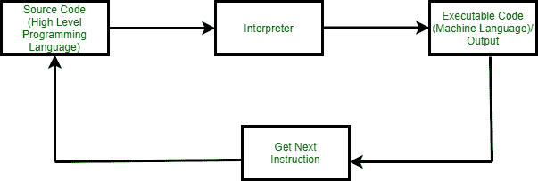

# 语言处理器:汇编器、编译器和解释器

> 原文:[https://www . geesforgeks . org/language-processors-assembler-compiler-and-interpreter/](https://www.geeksforgeeks.org/language-processors-assembler-compiler-and-interpreter/)

语言处理器–

编译器、解释器将高级语言编写的程序翻译成计算机能够理解的机器代码。汇编程序将低级或汇编语言编写的程序翻译成机器代码。在编译过程中，有几个阶段。为了帮助程序员编写无错代码，工具是可用的。

汇编语言是依赖于机器的，但是用于表示其中指令的助记符不能被机器直接理解，高级语言是独立于机器的。计算机理解机器代码中的指令，即 0 和 1 的形式。直接用机器代码编写计算机程序是一项乏味的工作。程序大多是用高级语言编写的，如 Java、C++、Python 等。并被称为源代码。这些源代码不能由计算机直接执行，必须转换成机器语言才能执行。因此，一个特殊的翻译器系统软件被用来把用高级语言编写的程序翻译成机器代码，它被称为语言处理器，翻译成机器代码(目标程序/目标代码)后的程序。

语言处理器可以是以下三种类型中的任何一种:

**1。编译器:**
把用高级语言编写的完整源程序作为一个整体一口气读完并翻译成机器语言等价程序的语言处理器，叫做编译器。例子:C，C++，C#，Java。

在编译器中，如果源代码没有错误，它就会被成功地翻译成目标代码。当源代码中有任何错误时，编译器用行号指定编译结束时的错误。在编译器能够再次成功地重新编译源代码之前，必须删除这些错误

**2。汇编程序:**
汇编程序用于将汇编语言编写的程序翻译成机器码。源程序是包含汇编语言指令的汇编程序的输入。汇编程序产生的输出是计算机可以理解的目标代码或机器代码。汇编程序基本上是第一个能够与机器进行人机交流的接口。我们需要一个汇编程序来填补人和机器之间的空白，这样他们就可以相互通信。用汇编语言编写的代码是某种助记符(指令)，比如 ADD、MUL、MUX、SUB、DIV、MOV 等等。汇编程序基本上能够将这些助记符转换成二进制代码。这里，这些助记符也取决于机器的结构。

例如，英特尔 8085 和英特尔 8086 的架构是不同的。

**3。解释器:**
将源程序的一条语句翻译成机器代码是由语言处理器完成的，并在进入下一行之前立即执行，称为解释器。如果语句中有错误，解释器将终止该语句的翻译过程，并显示一条错误消息。解释器只有在删除错误后才进入下一行执行。解释器直接执行用编程或脚本语言编写的指令，而无需事先将它们转换成目标代码或机器代码。

例子:Perl、Python 和 Matlab。

**编译器和解释器的区别–**

<figure class="table">

| 编译程序 | 解释者 |
| --- | --- |
| 编译器是一种程序，它将编程语言的全部源代码转换为中央处理器的可执行机器代码。
 | 解释器获取一个源程序，一行一行地运行，翻译每一行 |
| 编译器花费大量时间来分析整个源代码，但是程序的整体执行时间相对较快。
 | 解释器花费较少的时间来分析源代码，但是程序的整体执行时间较慢。 |
| 编译器只有在扫描整个程序后才会生成错误消息，因此调试相对困难，因为错误可能出现在程序的任何地方。 | 它的调试更容易，因为它继续翻译程序，直到遇到错误。 |
| 编译器需要大量内存来生成目标代码。 | 它比编译器需要更少的内存，因为没有生成目标代码。 |
| 生成中间目标代码。 | 没有生成中间目标代码。 |
| 出于安全目的，编译器更有用。 | 为了安全起见，翻译有点脆弱。 |
| 例子:C，C++，Java | 示例:Python、Perl、JavaScript、Ruby |

</figure>