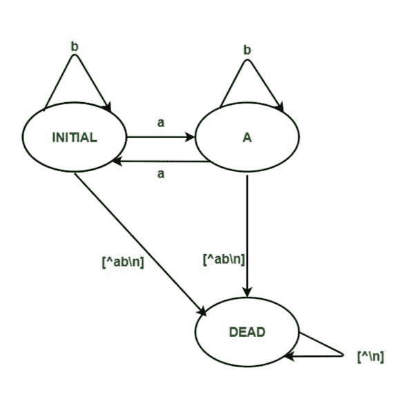
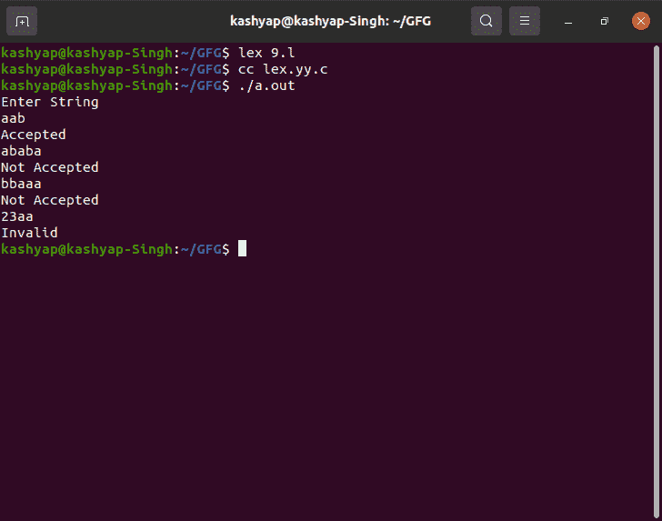

# LEX 代码，接受输入字母表{a，b}

上偶数为' a '的字符串

> 原文:[https://www . geesforgeks . org/lex-code-accept-string-with-numbers-over-input-alphabet-ab/](https://www.geeksforgeeks.org/lex-code-that-accepts-string-having-even-numbers-of-a-over-input-alphabet-ab/)

**先决条件:** [<u>设计有限自动机</u>](https://www.geeksforgeeks.org/designing-deterministic-finite-automata-set-1/)

**简介:**
在本文中，我们将讨论 LEX Code 中的 [<u>DFA</u>](https://www.geeksforgeeks.org/minimization-of-dfa/) ，该代码接受输入字母表{a，b}上具有偶数个“a”的字符串。借助例子。让我们逐一讨论。

**问题概述:**
LEX 代码，接受输入字母表{a，b}上偶数为' a '的字符串。

**示例–**

```
Input : aba
Output: Accepted

Input : ababba
Output: Not Accepted

Input: 23ab
Output:Invalid

Input:ab345
Output:Invalid

Input:aabababa
Output:Not Accepted
```

**方法:**
LEX 默认为我们提供一个 INITIAL 状态。所以要做一个 [DFA](https://www.geeksforgeeks.org/introduction-of-finite-automata/) ，用这个作为 DFA 的初始状态。
我们定义了另外两种状态——A 和 DEAD，如果遇到错误或无效的输入，将使用 DEAD 状态。当用户输入无效字符时，移至 DEAD 状态，然后打印“**无效**”。
如果输入字符串在 A 处结束，则显示消息“**不接受**”。否则，如果输入字符串在初始状态结束，则显示消息“**接受**”。



**注意:**
要编译 lex 程序，我们需要一个安装了 flex 的 Unix 系统。然后我们需要用。l 分机。

```
Example - filename.l
```

然后在保存程序后，关闭 Lex 文件，然后打开终端，编写如下命令。

```
lex filename.l
cc lex.yy.c
./a.out
```

**LEX CODE :**

```
%{
%}

%s A DEAD

%%
<INITIAL>a BEGIN A;
<INITIAL>b BEGIN INITIAL;
<INITIAL>[^ab\n] BEGIN DEAD;
<INITIAL>\n BEGIN INITIAL; {printf("Accepted\n");}

<A>a BEGIN INITIAL;
<A>b BEGIN A;
<A>[^ab\n] BEGIN DEAD;
<A>\n BEGIN INITIAL; {printf("Not Accepted\n");}

<DEAD>[^\n] BEGIN DEAD;
<DEAD>\n BEGIN INITIAL; {printf("Invalid\n");}

%%

int yywrap()
{
return 1;
}  
int main()
{
   printf("Enter String\n");
   yylex();
return 0;
}
```

**输出–**

