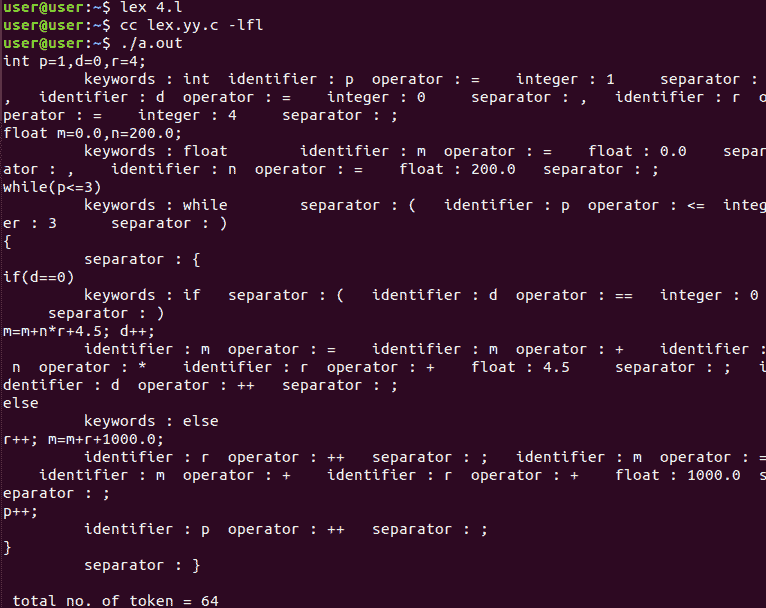

# 计算代币总数的 Lex 代码

> 原文:[https://www . geesforgeks . org/lex-code-to-count-token 总数/](https://www.geeksforgeeks.org/lex-code-to-count-total-number-of-tokens/)

Lex 是一个生成词法分析器的计算机程序，由 Mike Lesk 和 Eric Schmidt 编写。Lex 读取指定词法分析器的输入流，并输出用 C 编程语言实现 lex 的源代码。

**标记:**标记是一组形成基本原子语法块的字符，即标记是与模式匹配的一类词汇。例如–关键词、标识符、运算符、分隔符。

**示例:**

```
Input: int p=0, d=1, c=2;

Output: 
total no. of tokens = 13

```

以下是上述解释的实现:

```
/*Lex code to count total number of tokens */

%{ 
int n = 0 ;  
%} 

// rule section
%% 

//count number of keywords
"while"|"if"|"else" {n++;printf("\t keywords : %s", yytext);}  

// count number of keywords
"int"|"float" {n++;printf("\t keywords : %s", yytext);}   

// count number of identifiers
[a-zA-Z_][a-zA-Z0-9_]* {n++;printf("\t identifier : %s", yytext);} 

// count number of operators
"<="|"=="|"="|"++"|"-"|"*"|"+" {n++;printf("\t operator : %s", yytext);}

// count number of separators
[(){}|, ;]    {n++;printf("\t separator : %s", yytext);} 

// count number of floats
[0-9]*"."[0-9]+ {n++;printf("\t float : %s", yytext);}  

// count number of integers
[0-9]+ {n++;printf("\t integer : %s", yytext);}                        

.    ;
%% 

int main() 

{ 

    yylex();

    printf("\n total no. of token = %d\n", n);   

} 
```

**输出:**
