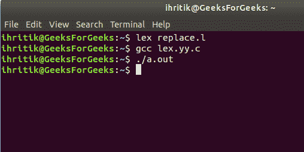
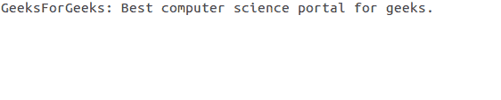

# 用文件中的另一个单词替换一个单词的 Lex 代码

> 原文:[https://www . geesforgeks . org/lex-code-to-replace-a-word-in-a-file/](https://www.geeksforgeeks.org/lex-code-to-replace-a-word-with-another-word-in-a-file/)

给定一个文本文件作为输入，任务是用文件中的另一个单词替换给定的单词。

Lex 是一个生成词法分析器的计算机程序，由 Mike Lesk 和 Eric Schmidt 编写。
Lex 读取指定词法分析器的输入流，并输出用 C 编程语言实现 lexer 的源代码。

**先决条件:** [Flex(快速词汇分析器生成器)](https://www.geeksforgeeks.org/flex-fast-lexical-analyzer-generator/)

**进场:**
我们知道， **yytext** 持有当前匹配令牌的值，我们可以和 word 进行比较进行替换。如果 **yytext** 的值与要替换的单词相同，则用另一个单词替换该单词并将其写入输出文件，否则只需将输入文件的内容复制到输出文件即可。

**输入文件:** input.txt


下面是上述方法的实现:

```
/* LEX code to replace a word with another
   taking input from file */

/* Definition section */
/* variable replace_with and replace can be 
   accessed inside rule section and main() */

%{
#include<stdio.h>
#include<string.h>

char replace_with [] = "Best";
char replace [] ="A";

%}

/* Rule Section */
/* Rule 1 compares the matched token with the
   word to replace and replaces with another word
   on successful match else simply writes the
   content of input file to output file */
/* Rule 2 matches everything other than string
   like whitespace, digits, special symbols etc 
   and writes it to output file */

%%
[a-zA-Z]+    { if(strcmp(yytext, replace)==0)
                   fprintf(yyout, "%s", replace_with);
                else
                    fprintf(yyout, "%s", yytext);}
.            fprintf(yyout, "%s", yytext);
%%

int yywrap()
{
    return 1;
}

/* code section */
int main()
{
        extern FILE *yyin, *yyout;

        /* open the input file
           in read mode */
    yyin=fopen("input.txt", "r");

        /* open the output file
           in write mode */
    yyout=fopen("output.txt", "w");

        yylex();
}
```

**输出:**



**输出文件:** output.txt

