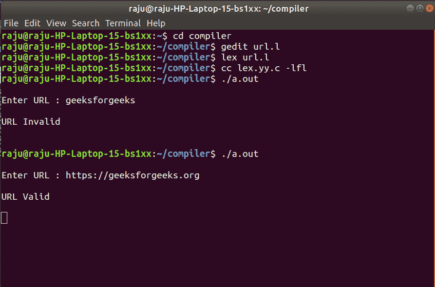

# 检查有效网址的莱克斯程序

> 原文:[https://www . geesforgeks . org/lex-program-for-checking-a-valid-URL/](https://www.geeksforgeeks.org/lex-program-for-checking-a-valid-url/)

**问题:**编写一个 Lex 程序来检查有效的 URL。

**解释:**
Lex 是一个生成一些词法分析器的计算机实用程序。Lex 读取一个字符流作为指定词法分析器的输入，并给出源代码作为在 C 编程语言中实现 lexer 的输出。

**先决条件:** [Flex(快速词汇分析器生成器)](https://www.geeksforgeeks.org/flex-fast-lexical-analyzer-generator/)

**示例:**

```
Input: geeksforgeeks 
Output: INVALID URL

Input: https://www.geeksforgeeks.org
Output: VALID URL 
```

**实施:**

```
%%
((http)|(ftp))s?:\/\/[a-zA-Z0-9]{2, }(\.[a-z]{2, })
       +(\/[a-zA-Z0-9+=?]*)* {printf("\nURL Valid\n");}

.+ {printf("\nURL Invalid\n");}

%%

// driver program
void main() 
 {
    printf("\nEnter URL : ");
    yylex();
    printf("\n");
 }
```

**输出:**

