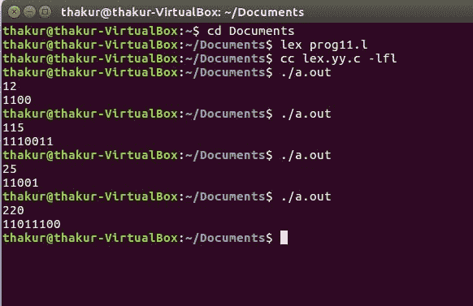

# 十进制到二进制转换的 Lex 程序

> 原文:[https://www . geesforgeks . org/lex-十进制到二进制转换程序/](https://www.geeksforgeeks.org/lex-program-for-decimal-to-binary-conversion/)

**问题:**编写一个 Lex 程序进行十进制到二进制的转换。

**说明:**
[FLEX(快速词法分析器生成器)](https://www.geeksforgeeks.org/flex-fast-lexical-analyzer-generator/)是 Vern Paxson 在 1987 年前后用 C 语言编写的一个用于生成词法分析器(扫描仪或 lexers)的工具/计算机程序。Lex 读取指定词法分析器的输入流，并输出用 C 编程语言实现 lexer 的源代码。函数 yylex()是运行规则部分的主要灵活函数。

**示例:**

```
Input: 12 
Output: 1100

Input: 115
Output: 1110011

Input: 25
Output: 11001

Input: 220
Output: 11011100 
```

**实施:**

```
/* Lex program for decimal to binary conversion */

%{
  /* Definition section */
  #include<stdio.h>
  int num, r, b=0, p=1;
%}

DIGIT [0-9]
/* Rule Section */
%%
{DIGIT}+   { num=atoi(yytext);
             while (num > 0)
             {
              r= num % 2;
              b+= r*p;
              p*= 10;
              num/= 2;
             }
              printf("%d", b);
            }
.|\n    ECHO;

%%

// driver code 
int main()
{
    yylex();
    return 0;
}      
```

**输出:**

