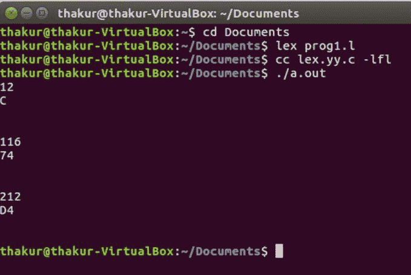

# 十进制到十六进制转换的 Lex 程序

> 原文:[https://www . geesforgeks . org/lex-program-for-decimal-to-十六进制转换/](https://www.geeksforgeeks.org/lex-program-for-decimal-to-hexadecimal-conversion/)

**问题:**编写一个 Lex 程序进行十进制到十六进制的转换。

**解释:**
Lex 读取指定词法分析器的输入流，并输出用 C 编程语言实现 lexer 的源代码。函数 yylex()是运行规则部分的主要灵活函数。

**先决条件:** [Flex(快速词汇分析器生成器)](https://www.geeksforgeeks.org/flex-fast-lexical-analyzer-generator/)

**示例:**

```
Input: 12 
Output: C

Input: 116
Output: 74

Input: 55
Output: 37

Input: 212
Output: D4 
```

**实施:**

```
/* Lex program for decimal to hexadecimal conversion */

%{
    /* Definition section */
    #include<stdio.h>
    int num, r, digit=0, count, pcount=0, i;
    char a[20];
%}

DIGIT [0-9]
/* Rule Section */
%%

{DIGIT}+ { num=atoi(yytext);

        while(num!=0)
        {

            r=num%16;
            digit='0'+r;
            if(digit>'9')
            digit+=7;
            a[count++]=digit;
            num=num/16;

        }

        for(i=count-1;i>=pcount;--i)
                printf("%c", a[i]);
                pcount=count;
        }

.|\n    ECHO;

%%

// driver code
int main()
{
    yylex();
    return 0;
}      
```

**输出:**

