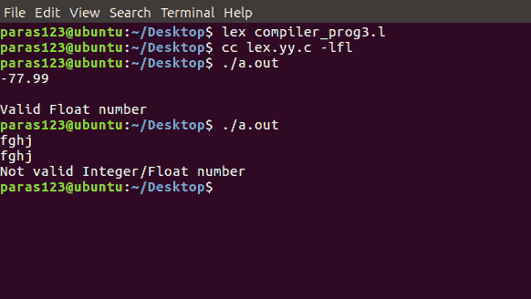

# Lex 程序接受有效的整数和浮点值

> 原文:[https://www . geesforgeks . org/lex-program-to-accept-a-valid-integer-and-float-value/](https://www.geeksforgeeks.org/lex-program-to-accept-a-valid-integer-and-float-value/)

[Lex](https://www.geeksforgeeks.org/flex-fast-lexical-analyzer-generator/) 是一个生成词法分析器的计算机程序。
Lex 读取指定词法分析器的输入流，并输出用 C 编程语言实现 lexer 的源代码。

执行 lex 程序的命令有:

```
lex abc.l (abc is the file name)
cc lex.yy.c -efl
./a.out

```

让我们看看如何使用 lex 程序接受一个有效的整数和浮点值
。

**示例:**

```
Input : 
-77.99
Output :
 Valid Float Value

Input : 
fghj
Output : 
Not a valid Integer/ Float number

```

下面是实现:

```
/*lex code to accept a valid integer 
  and float value using lex program.*/

%{
int valid_int=0, valid_float=0;
%}

%%
^[-+]?[0-9]* valid_int++;
^[-+]?[0-9]*[.][0-9]+$ valid_float++;
.;
%%

int main()
{
  yylex();
  if(valid_int!=0) printf("Valid Integer number\n");
  else if(valid_float!=0) printf("Valid Float number\n");
  else printf("Not valid Integer/Float number\n");
  return 0;
}
```

**输出:**

