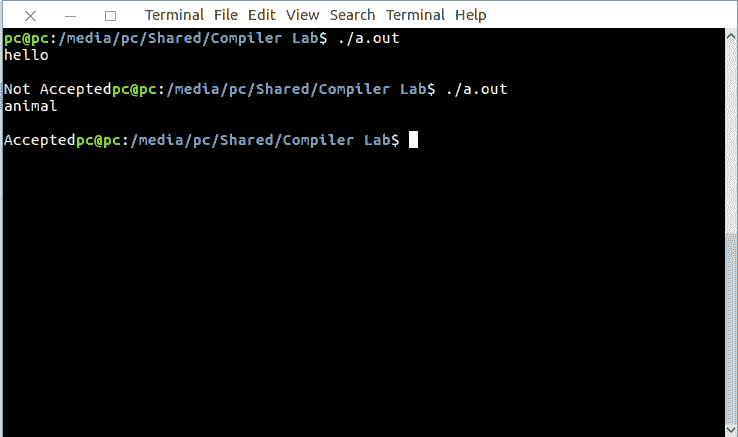

# Lex 程序接受以元音开头的字符串

> 原文:[https://www . geesforgeks . org/lex-program-to-accept-string-以元音开头/](https://www.geeksforgeeks.org/lex-program-to-accept-string-starting-with-vowel/)

[Lex](https://www.geeksforgeeks.org/flex-fast-lexical-analyzer-generator/) 是一个生成词法分析器的计算机程序。Lex 读取指定词法分析器的输入流，并输出用 C 编程语言实现 lexer 的源代码。

执行 lex 程序的命令有:

```
lex abc.l (abc is the file name)
cc lex.yy.c -efl
./a.out 
```

让我们看看 lex 程序接受以元音开头的字符串。
**例:**

```
Input: animal
Output: Accepted

Input: zebra
Output: Not Accepted 
```

下面是实现:

```
/* Lex Program to accept string starting with vowel */
% {
  int flag = 0;
% }

%%

[aeiouAEIOU].[a-zA-Z0-9.]+ flag=1;
[a-zA-Z0-9]+

%%

main()
{
 yylex();
 if (flag == 1) 
    printf("Accepted"); 
 else
    printf("Not Accepted"); 
}
```

**输出:**

