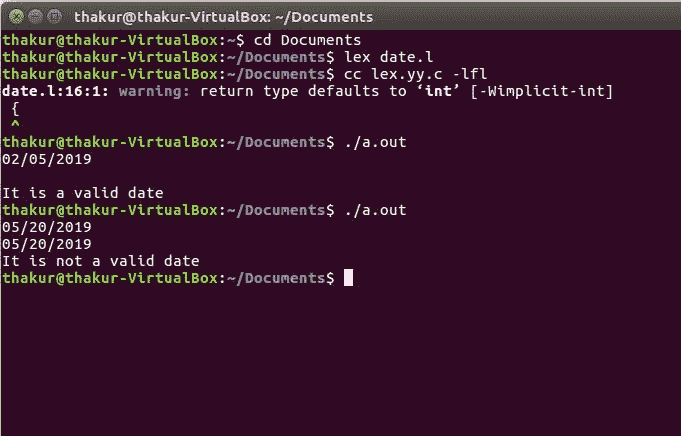

# Lex 程序检查日期是否有效

> 原文:[https://www . geesforgeks . org/lex-程序检查日期是否有效/](https://www.geeksforgeeks.org/lex-program-to-check-if-a-date-is-valid-or-not/)

**问题:**写一个 Lex 程序，检查一个日期是否有效。

**说明:**
[Flex(快速词法分析器生成器)](https://www.geeksforgeeks.org/flex-fast-lexical-analyzer-generator/)是 1987 年前后由 Vern Paxson 用 C 语言编写的一个用于生成词法分析器(扫描仪或 lexers)的工具/计算机程序。Lex 读取指定词法分析器的输入流，并输出用 C 编程语言实现 lexer 的源代码。函数 yylex()是运行规则部分的主要灵活函数。

**注:**日期格式为日/月/年。

**示例:**

```
Input: 02/05/2019
Output: It is a valid date

Input: 05/20/2019
Output: It is not a valid date 
```

**实施:**

```
/* Lex program to check if a date is valid or not */

%{
   /* Definition section */
   #include<stdio.h>
   int i=0, yr=0, valid=0;
%}

/* Rule Section */
%%
([0-2][0-9]|[3][0-1])\/((0(1|3|5|7|8))|(10|12))
            \/([1-2][0-9][0-9][-0-9]) {valid=1;}

([0-2][0-9]|30)\/((0(4|6|9))|11)
         \/([1-2][0-9][0-9][0-9]) {valid=1;}

([0-1][0-9]|2[0-8])\/02
            \/([1-2][0-9][0-9][0-9]) {valid=1;}

29\/02\/([1-2][0-9][0-9][0-9]) 
     { while(yytext[i]!='/')i++; i++;
       while(yytext[i]!='/')i++;i++;
       while(i<yyleng)yr=(10*yr)+(yytext[i++]-'0'); 
       if(yr%4==0||(yr%100==0&&yr%400!=0))valid=1;}

%%

// driver code 
main()
{
  yyin=fopen("vpn.txt", "r");
  yylex();
  if(valid==1) printf("It is a valid date\n");
  else printf("It is not a valid date\n");
}
 int yywrap()
{
 return 1;
}
```

**输出:**

