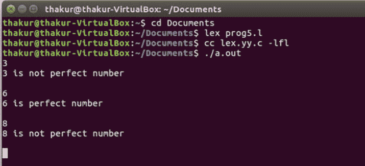

# Lex 程序检查完全数

> 原文:[https://www . geesforgeks . org/lex-program-to-check-perfect-numbers/](https://www.geeksforgeeks.org/lex-program-to-check-perfect-numbers/)

[Lex](https://www.geeksforgeeks.org/flex-fast-lexical-analyzer-generator/) 是一个生成词法分析器的计算机程序，由 Mike Lesk 和 Eric Schmidt 编写。Lex 读取指定词法分析器的输入流，并输出用 C 编程语言实现 lexer 的源代码。

**描述:** [完全数](https://www.geeksforgeeks.org/perfect-number/)，一个等于其适当除数之和的正整数，例如:6 = 1+2+3。

**示例:**

```
Input: 3
Output: 3 is not perfect number

Input: 6
Output: 6 is perfect number 
```

**实施:**

```
/*Lex program to check perfect numbers*/

%
{
#include <string.h>
    void check(char*);
    %
}

/*Rule Section*/
% %
        [0 - 9]
    + check(yytext);
% % int main()
{
    // the input stream pointer
    extern FILE* yyin;

    // open a file handle to a particular file
    yyin = fopen("num", "r");

    // The function that starts the analysis
    yylex();
    return 0;
}
void check(char* a)
{
    int len = strlen(a), i, num = 0;

    for (i = 0; i < len; i++)
        num = num * 10 + (a[i] - '0');

    int x = 0, temp = num;
    for (i = 1; i < num; i++) {
        if (num % i == 0)
            x = x + i;
    }
    if (x == temp)
        printf("%d is perfect number \n", num);

    else
        printf("%d is not perfect number \n", num);
}
```

**输出:**

