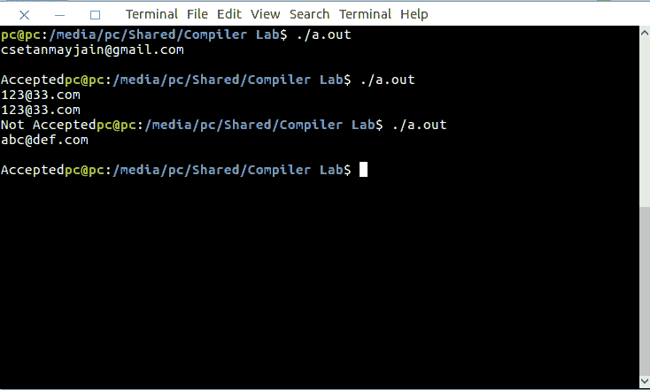

# Lex 程序检查有效电子邮件

> 原文:[https://www . geesforgeks . org/lex-程序到检查-有效-电子邮件/](https://www.geeksforgeeks.org/lex-program-to-check-valid-email/)

[Lex](https://www.geeksforgeeks.org/flex-fast-lexical-analyzer-generator/) 是一个生成词法分析器的计算机程序。Lex 读取指定词法分析器的输入流，并输出用 C 编程语言实现 lexer 的源代码。

执行 lex 程序的命令有:

```
lex abc.l (abc is the file name)
cc lex.yy.c -efl
./a.out

```

让我们看看 lex 程序来检查有效的电子邮件。

**示例:**

```
Input : 
csetanmayjain@gmail.com
Output :
 Valid

Input : 
!23@43.com
Output : 
Not Valid

```

下面是实现:

```
/*lex code to accept a  valid email */ 
%
{
  int flag = 0; %
} %
% [a - z.0 - 9 _] + @[a - z] + ".com" | ".in"
flag = 1; %
%
main() {
  yylex();
  if (flag == 1)
    printf("Accepted");
  else
    printf("Not Accepted");
}
```

**输出:**

