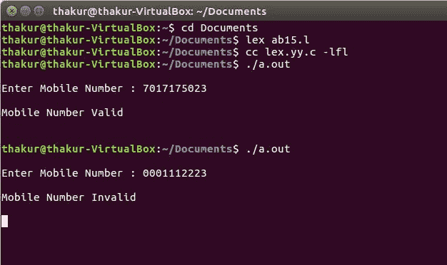

# Lex 程序检查有效手机号码

> 原文:[https://www . geesforgeks . org/lex-程序检查-有效-手机号码/](https://www.geeksforgeeks.org/lex-program-to-check-valid-mobile-number/)

**问题:**编写 Lex 程序检查有效的手机号码。

**说明:**
[FLEX(快速词法分析器生成器)](https://www.geeksforgeeks.org/flex-fast-lexical-analyzer-generator/)是 Vern Paxson 在 1987 年前后用 C 语言编写的一个用于生成词法分析器(扫描仪或 lexers)的工具/计算机程序。Lex 读取指定词法分析器的输入流，并输出在 [C 编程语言](https://www.geeksforgeeks.org/c-programming-language/)中实现 lexer 的源代码。函数 yylex()是运行规则部分的主要灵活函数。

**示例:**

```
Input: 7017175023
Output: Mobile Number Valid

Input: 0001112223
Output: Mobile Number Invalid 
```

**实施:**

```
/* Lex Program to check valid Mobile Number */

%{
    /* Definition section */
%}

/* Rule Section */
%%

[1-9][0-9]{9} {printf("\nMobile Number Valid\n");}

.+ {printf("\nMobile Number Invalid\n");}

%%

// driver code 
int main() 
{
    printf("\nEnter Mobile Number : ");
    yylex();
    printf("\n");
    return 0;
}
```

**输出:**

