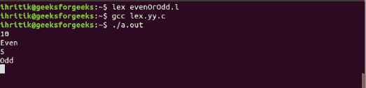

# Lex 程序检查给定数字是偶数还是奇数

> 原文:[https://www . geesforgeks . org/lex-program-to-check-给定的数字是偶数还是奇数/](https://www.geeksforgeeks.org/lex-program-to-check-whether-a-given-number-is-even-or-odd/)

给定一个数字 n，任务是使用 Lex 程序检查给定的 n 是偶数还是奇数。

**示例:**

```
Input : 10 
Output : Even

Input : 5
Output : Odd

```

**先决条件:** [FLEX(快速词汇分析器生成器)](https://www.geeksforgeeks.org/flex-fast-lexical-analyzer-generator/)

偶数是可被 2“整除”的整数。这意味着，如果整数被 2 除，它不产生余数，或者余数为 0。类似地，奇数是不能被 2“整除”的整数，剩下 1 作为余数。

下面是上述方法的实现:

```
/*Lex program to take check whether
the given number is even or odd */

%{
#include<stdio.h>
int i;
%}

%%

[0-9]+     {i=atoi(yytext);
          if(i%2==0) 
               printf("Even");
          else
         printf("Odd");}
%%

int yywrap(){}

/* Driver code */
int main()
{

    yylex();
    return 0;
}
```

**输出:**
