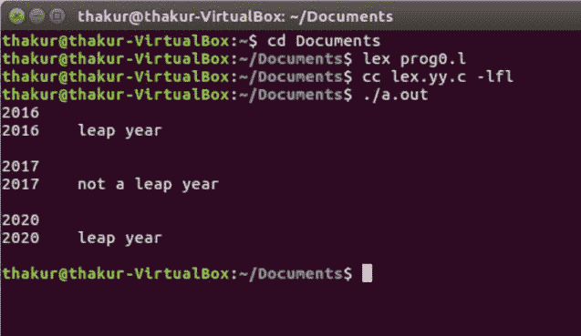

# Lex 程序检查一年是否是闰年

> 原文:[https://www . geesforgeks . org/lex-program-to-check-一年是不是闰年/](https://www.geeksforgeeks.org/lex-program-to-check-whether-an-year-is-a-leap-year-or-not/)

**问题:**写一个 Lex 程序，检查一年是不是闰年。

**解释:**
[Lex](http://Flex (Fast Lexical Analyzer Generator )) 是一个生成词法分析器的计算机程序，由 Mike Lesk 和 Eric Schmidt 编写。Lex 读取指定词法分析器的输入流，并输出用 C 编程语言实现 lexer 的源代码。

**注:**闰年是可被 400 整除或可被 4 整除而不能被 100 整除的年份。所以 2016 年、2020 年等是闰年，而 2017 年和 2019 年不是。

**示例:**

```
Input: 2016 
Output: leap year

Input: 2017
Output: not a leap year 
```

**实施:**

```
/*Lex program to check whether an year is a leap year or not*/

%{
 void check(char *);
%}

/*Rule Section*/
 %%   
[0-9]    ;
[0-9][0-9]    ;
[0-9][0-9][0-9]     ;
[0-9][0-9][0-9][0-9]    { printf("%s", yytext);check(yytext); }
[0-9][0-9][0-9][0-9][0-9]+ ;
 %%

// driver program
int main()
{
    extern FILE *yyin;
    yyin=fopen("num", "r");

    // The function that starts the analysis 
    yylex();
    return 0;

}

void check(char *a)
{
    int x=0, i;

    for(i=0;i<4;i++)
        x=x*10+(a[i]-'0');

    if(x%400==0)   
        printf("\tleap year\n");

    else if(x%4==0&&x%100!=0)
        printf("\tleap year\n");

    else
        printf("\tnot a leap year\n");
}
```

**输出:**

