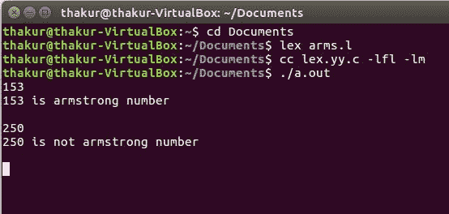

# Lex 程序检查给定号码是否为阿姆斯特朗号码

> 原文:[https://www . geesforgeks . org/lex-program-to-check-给定号码是不是-armstrong-number-or-not/](https://www.geeksforgeeks.org/lex-program-to-check-whether-given-number-is-armstrong-number-or-not/)

**问题:** Lex 程序检查给定号码是否为阿姆斯特朗号码。

**解释:**
[Lex](https://www.geeksforgeeks.org/flex-fast-lexical-analyzer-generator/) 是一个生成词法分析器的计算机程序，由 Mike Lesk 和 Eric Schmidt 编写。Lex 读取指定词法分析器的输入流，并输出用 C 编程语言实现 lexer 的源代码。

**描述:**
阿姆斯壮数是其自身位数的和，每个位数都是位数的幂。例如，153 是阿姆斯特朗号码，

```
(1^3) + (5^3) + (3^3) = 153 
```

**示例:**

```
Input: 153 
Output: 153 is a Armstrong number

Input: 250
Output: 250 is not a Armstrong number 
```

**实施:**

```
/* Lex program to check whether given 
    - number is armstrong number or not */
%
{
/* Definition section */
#include <math.h>
#include <string.h>
    void check(char*);
    %
}

/* Rule Section */
% %
        [0 - 9]
    + check(yytext);
% % 

int main()
{
    /* yyin as pointer of File type */
    extern FILE* yyin;
    yyin = fopen("num", "r");

    // The function that starts the analysis
    yylex();

    return 0;
}
void check(char* a)
{
    int len = strlen(a), i, num = 0;
    for (i = 0; i < len; i++)
        num = num * 10 + (a[i] - '0');

    int x = 0, y = 0, temp = num;
    while (num > 0) {
        y = pow((num % 10), len);
        x = x + y;
        num = num / 10;
    }

    if (x == temp)
        printf("%d is armstrong number \n", temp);
    else
        printf("%d is not armstrong number\n", temp);
}
```

**输出:**

