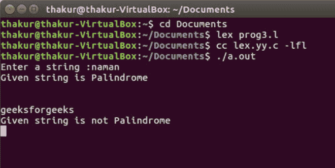

# Lex 程序检查给定字符串是否回文

> 原文:[https://www . geesforgeks . org/lex-program-to-check-给定字符串是否是回文/](https://www.geeksforgeeks.org/lex-program-to-check-whether-given-string-is-palindrome-or-not/)

**问题:**写一个 Lex 程序，检查给定的字符串是不是回文。

**解释:**
[Lex](https://www.geeksforgeeks.org/flex-fast-lexical-analyzer-generator/) 是一个生成词法分析器的计算机程序，由 Mike Lesk 和 Eric Schmidt 编写。Lex 读取指定词法分析器的输入流，并输出用 C 编程语言实现 lexer 的源代码。

**说明:**如果串的反序与串相同，则称串为[回文](https://www.geeksforgeeks.org/string-palindrome/)。比如“abba”是回文，但“abbc”不是回文。

**示例:**

```
Input: Enter a string : naman 
Output: Given string is Palindrome

Input: Enter a string : geeksforgeeks
Output: Given string is not Palindrome 
```

**实施:**

```
/* Lex program to check whether 
     - given string is Palindrome or Not */

%
 {
    int i, j, flag;
    %
 }

/* Rule Section */
% %
    [a - z A - z 0 - 9]*
{
    for (i = 0, j = yyleng - 1; i <= j; i++, j--) {
        if (yytext[i] == yytext[j]) {
            flag = 1;
        }
        else {
            flag = 0;
            break;
        }
    }
    if (flag == 1)
        printf("Given string is Palindrome");
    else
        printf("Given string is not Palindrome");
}
% %

    // driver code
    int main()
{
    printf("Enter a string :");
    yylex();
    return 0;
}

int yywrap()
{
    return 1;
}
```

**输出:**

