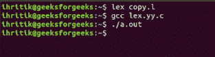

# Lex 程序将一个文件的内容复制到另一个文件

> 原文:[https://www . geeksforgeeks . org/lex-程序将一个文件的内容复制到另一个文件/](https://www.geeksforgeeks.org/lex-program-to-copy-the-content-of-one-file-to-another-file/)

**问题:**给定一个文本文件作为输入，任务是将给定文件的内容复制到另一个文件。
**解释:**
[Lex](https://www.geeksforgeeks.org/flex-fast-lexical-analyzer-generator/) 是一个生成词法分析器的计算机程序，由 Mike Lesk 和 Eric Schmidt 编写。Lex 读取指定词法分析器的输入流，并输出用 C 编程语言实现 lexer 的源代码。
**进场:**
我们知道， **yytext** 保存当前令牌匹配的文本。将 **yytext** 的值追加到临时字符串中。如果遇到换行符(' \n ')，将临时字符串的内容写入目标文件。
**输入文件:** input.txt

```
GeeksForGeeks: A Computer Science portal for geeks.
```

以下是上述方法的实现:

## C

```
/* LEX code to replace a word with another
   taking input from file */

/* Definition section */
/* character array line can be 
   accessed inside rule section and main() */

%{
#include<stdio.h>
#include<string.h>
char line[100];

%}

/* Rule Section */
/* Rule 1 writes the string stored in line
   character array to file output.txt */
/* Rule 2 copies the matched token
   i.e every character except newline character
    to line character array  */

%%
['\n']    { fprintf(yyout,"%s\n",line);}
(.*)      { strcpy(line,yytext); line[0] = '\0'; }
<<EOF>> { fprintf(yyout,"%s",line); return 0;}
%%

int yywrap()
{
    return 1;
}

/* code section */
int main()
{
        extern FILE *yyin, *yyout;
        /* open the source file
           in read mode */
    yyin=fopen("input.txt","r");

        /* open the output file
           in write mode */
    yyout=fopen("output.txt","w");
    yylex();
}
```

**输出:**



**输出文件:** output.txt

```
GeeksForGeeks: A Computer Science portal for geeks.
```