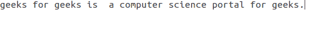
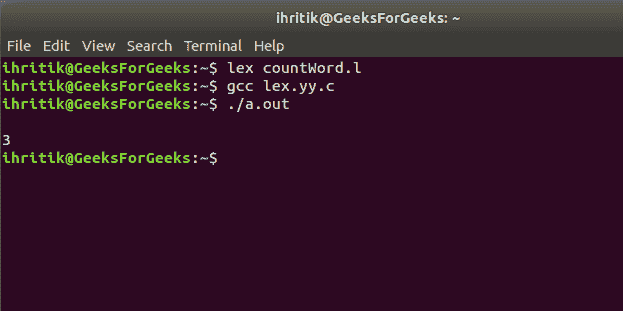

# Lex 程序统计给定单词在文件中出现的频率

> 原文:[https://www . geesforgeks . org/lex-program-to-count-the-frequency-of-the-给定的单词在文件中的出现频率/](https://www.geeksforgeeks.org/lex-program-to-count-the-frequency-of-the-given-word-in-a-file/)

**问题:**给定一个文本文件作为输入，任务是统计该文件中给定单词的出现频率。
**解释:**
[Lex](https://www.geeksforgeeks.org/flex-fast-lexical-analyzer-generator/) 是一个生成词汇分析器的计算机程序，由迈克·莱斯克和埃里克·施密特编写。Lex 读取指定词汇分析器的输入流，并输出用 C 编程语言实现 lexer 的源代码。
**Approach:**
我们知道 **yytext** 持有当前匹配令牌的值，我们可以将其与需要统计频率的单词进行比较。如果**ytext**的值与给定单词相同，则递增计数变量。
**输入文件:** input.txt



下面是上述方法的实现:

## C

```
/* LEX code to count the frequency
   of the given word in a file */

/* Definition section */
/* variable word indicates the word
   whose frequency is to be count */
/* variable count is used to store the
   frequency of the given word */

%{
#include<stdio.h>
#include<string.h>

char word [] = "geeks";
int count = 0;

%}

/* Rule Section */
/* Rule 1 compares the matched token with the
   word to count and increments the count variable
   on successful match  */
/* Rule 2 matches everything other than string
   (consists of alphabets only ) and do nothing */

%%
[a-zA-Z]+    { if(strcmp(yytext, word)==0)
                   count++; }
.  ;        
%%

int yywrap()
{
    return 1;
}

/* code section */
int main()
{
        extern FILE *yyin, *yyout;

        /* open the input file
           in read mode */
        yyin=fopen("input.txt", "r");
        yylex();

        printf("%d", count);

}
```

**输出:**

