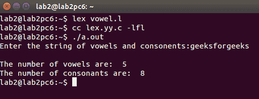

# LEX 程序统计给定字符串中元音和辅音的个数

> 原文:[https://www . geesforgeks . org/lex-program-to-count-给定字符串中元音和辅音的数量/](https://www.geeksforgeeks.org/lex-program-to-count-the-number-of-vowels-and-consonants-in-a-given-string/)

**先决条件:** [Flex(快速词汇分析器生成器)](https://www.geeksforgeeks.org/flex-fast-lexical-analyzer-generator/)

给定一个包含元音和辅音的字符串，编写一个 LEX 程序来统计给定字符串中元音和辅音的数量。

**示例:**

```
Input: Hello everyone
Output: Number of vowels are: 6
        Number of consonants are: 7

Input: This is GeeksforGeeks
Output: Number of vowels are: 7
        Number of consonants are: 12

```

**进场-**
进场很简单。如果发现任何元音增加*元音计数*，如果发现辅音增加*辅音计数*否则不做任何事情。

下面是实现:

```
%{
    int vow_count=0;
    int const_count =0;
%}

%%
[aeiouAEIOU] {vow_count++;}
[a-zA-Z] {const_count++;}
%%
int yywrap(){}
int main()
{
    printf("Enter the string of vowels and consonents:");
    yylex();
    printf("Number of vowels are:  %d\n", vow_count);
    printf("Number of consonants are:  %d\n", const_count);
    return 0;
} 
```

**输出:**
