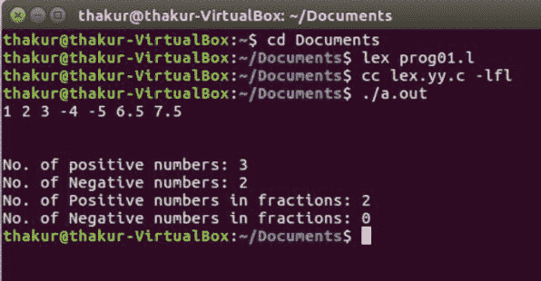

# 计算正数、负数和分数的 Lex 程序

> 原文:[https://www . geesforgeks . org/lex-program-to-count-the-正数-负数-和分数/](https://www.geeksforgeeks.org/lex-program-to-count-the-positive-numbers-negative-numbers-and-fractions/)

**问题:**写一个 Lex 程序，计算正数、负数和分数

**说明:**
FLEX(快速词法分析器生成器)是 Vern Paxson 在 1987 年左右用 C 语言编写的一个用于生成词法分析器(扫描仪或 lexers)的工具/计算机程序。Lex 读取指定词法分析器的输入流，并输出用 C 编程语言实现 lexer 的源代码。函数 yylex()是运行规则部分的主要灵活函数。

**先决条件:** [Flex(快速词汇分析器生成器)](https://www.geeksforgeeks.org/flex-fast-lexical-analyzer-generator/)

**示例:**

```
Input: 2 -8 -2.5 8.5 
Output: No. of positive numbers: 1
        No. of Negative numbers: 1
        No. of Positive numbers in fractions: 1
        No. of Negative numbers in fractions: 1 

Input: 1 2 3 -4 -5 6.5 7.5 
Output: No. of positive numbers: 3
        No. of Negative numbers: 2
        No. of Positive numbers in fractions: 2
        No. of Negative numbers in fractions: 0 
```

**实施:**

```
/* Lex program to Count the Positive numbers, 
      - Negative numbers and Fractions  */

%{
     /* Definition section */
    int postiveno=0;
    int negtiveno=0;
    int positivefractions=0;
    int negativefractions=0;
%}

/* Rule Section */
DIGIT [0-9]
%%

\+?{DIGIT}+             postiveno++;
-{DIGIT}+               negtiveno++;

\+?{DIGIT}*\.{DIGIT}+   positivefractions++;
-{DIGIT}*\.{DIGIT}+     negativefractions++;
. ;   
%%

// driver code
int main()
{
    yylex();
    printf("\nNo. of positive numbers: %d", postiveno);
    printf("\nNo. of Negative numbers: %d", negtiveno);
    printf("\nNo. of Positive numbers in fractions: %d", positivefractions);
    printf("\nNo. of Negative numbers in fractions: %d\n", negativefractions);
    return 0;
}
```

**输出:**

