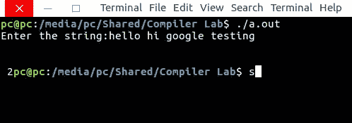

# Lex 程序计数小于 10 大于 5 的单词

> 原文:[https://www . geesforgeks . org/lex-程序对小于 10 且大于 5 的单词进行计数/](https://www.geeksforgeeks.org/lex-program-to-count-words-that-are-less-than-10-and-greater-than-5/)

**问题:**写一个 Lex 程序，统计小于 10 大于 5 的单词。

**解释:**
[Lex](https://www.geeksforgeeks.org/flex-fast-lexical-analyzer-generator/) 是一个生成词法分析器的计算机程序。Lex 读取指定词法分析器的输入流，并输出用 C 编程语言实现 lexer 的源代码。

执行 lex 程序的命令有:

```
lex abc.l (abc is the file name)
cc lex.yy.c -efl
./a.out

```

让我们看看 Lex 程序如何统计小于 10 且大于 5 的单词。

**示例:**

```
Input: geeksforgeeks hey google test lays
Output: 1 
```

下面是实现:

```
/*lex code to count words that are less than 10
    - and greater than 5 */

%{
  int len=0, counter=0;
%}

%%
[a-zA-Z]+ { len=strlen(yytext);
            if(len<10 && len>5)
              {counter++;} }
%%

int yywrap (void )
 {
    return 1;
 }

int main()
 {
  printf("Enter the string:");
  yylex();
  printf("\n %d", counter);
  return 0;
 }
```

**输出:**

