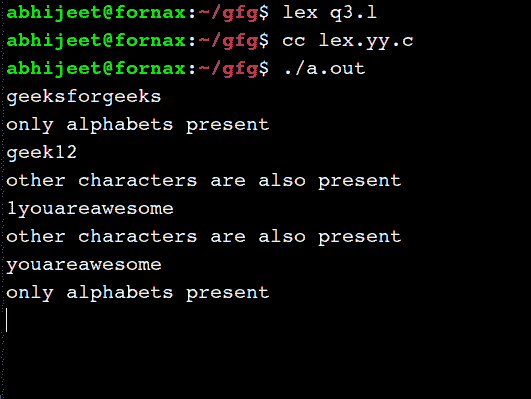

# Lex 程序，用于查找字符串中是否出现字母以外的字符

> 原文:[https://www . geesforgeks . org/lex-program-to-find-if-a-character-distant-in-a-string/](https://www.geeksforgeeks.org/lex-program-to-find-if-a-character-apart-from-alphabet-occurs-in-a-string/)

[**<u>【Lex】</u>**](https://www.geeksforgeeks.org/flex-fast-lexical-analyzer-generator/)<u>是一个生成词法分析器的计算机程序。Lex 读取指定词法分析器的输入流，并输出用 C 编程语言实现 lexer 的源代码。</u>

<u>**执行 lex 程序的命令有:**</u>

```
lex abc.l (abc is the file name)
cc lex.yy.c 
./a.out
```

<u>**问题:**写一个 lex 程序，找出给定字符串中是否出现字母表以外的字符。</u>

<u>**示例:**</u>

```
**Input :** GeeksforGeeks is best
**Output :** other characters are also present
**Explanation:** Because ' ' space is also a character

**Input :** geeksforgeeks
**Output :** only alphabets present
**Explanation:** Only english alphabets are present in the string
```

<u>**进场:**</u>

1.  <u>使用标志检查其他字符是否也存在；</u>
2.  <u>如果遇到**“\ n”**，我们将假设用户已经给出了完整的字符串，现在他希望显示结果</u>
3.  <u>所以根据旗帜的状态，我们会显示输出。</u>
4.  <u>否则如果遇到除 **(a-z，A-Z)** 以外的任何其他字符，我们将通过 [**正则表达式使标志= 1。**](https://www.geeksforgeeks.org/write-regular-expressions/)</u>

<u>**下面是实现:**</u>

## <u>C++</u>

```
/* lex code to check for characters other that
alphabets in a given string */

%{
int flag = 0;
%}

%%
[\n] {
    flag==0?printf("Only alphabets present\n"):
    printf("Other characters are also present\n");
    flag = 0;
}

[^a-zA-Z] {flag = 1;}

. {}
%%

int yywrap(void) {}

int main(){
    yylex();
    return 0;
}
```

<u>**输出:**</u>

<u></u>