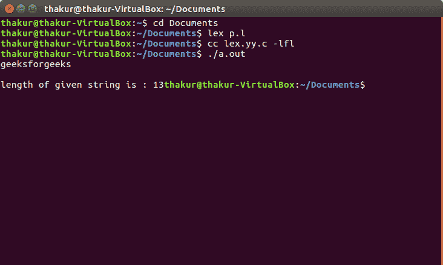

# Lex 程序求字符串长度

> 原文:[https://www . geesforgeks . org/lex-program-to-find-the-length-a-string/](https://www.geeksforgeeks.org/lex-program-to-find-the-length-of-a-string/)

**问题:**写一个 Lex 程序求一个字符串的长度

**解释:**
[FLEX(快速词法分析器生成器)](https://www.geeksforgeeks.org/flex-fast-lexical-analyzer-generator/)是一个生成词法分析器的计算机程序，由 Mike Lesk 和 Eric Schmidt 编写。Lex 读取指定词法分析器的输入流，并输出用 C 编程语言实现 lexer 的源代码。

**示例:**

```
Input: geeksforgeeks
Output: length of given string is : 13

Input: geeks
Output: length of given string is : 5 
```

**实施:**

```
/*lex program to find the length of a string*/

%{
  #include<stdio.h> 
  int  length;
%}

/* Rules Section*/
%%
  [a-z A-Z 0-9]+ {length=yyleng; }
%%

int main()
 {
  yylex();
  printf("length of given string is : %d", length);
  return 0;
 }
```

**输出:**

