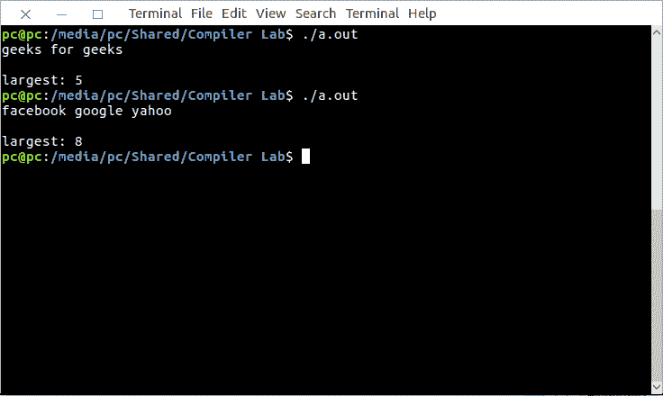

# Lex 程序查找最长单词的长度

> 原文:[https://www . geesforgeks . org/lex-program-to-find-最长单词的长度/](https://www.geeksforgeeks.org/lex-program-to-find-the-length-of-the-longest-word/)

[Lex](https://www.geeksforgeeks.org/flex-fast-lexical-analyzer-generator/) 是一个生成词法分析器的计算机程序。Lex 读取指定词法分析器的输入流，并输出用 C 编程语言实现 lexer 的源代码。

执行 lex 程序的命令有:

```
lex abc.l (abc is the file name)
cc lex.yy.c -efl
./a.out 
```

让我们看看 lex 程序来检查有效的电子邮件。

**示例:**

```
Input:  geeks for geeks
Output:  5

Input:  facebook google yahoo
Output:  8 
```

下面是实现:

```
/*lex code to find the length of the longest word*/

% {
  int counter = 0; %
}

%
% [a - zA - Z] + {
  if (yyleng > counter) {
    counter = yyleng;
  }
} %
%

main() {
  yylex();
  printf("largest: %d", counter);
  printf("\n");
}
```

**输出:**

