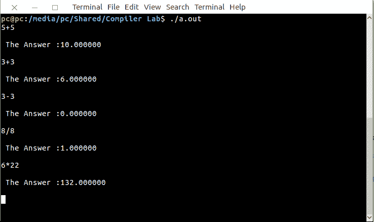

# Lex 程序实现简单计算器

> 原文:[https://www . geeksforgeeks . org/lex-程序实现简单计算器/](https://www.geeksforgeeks.org/lex-program-to-implement-a-simple-calculator/)

[Lex](https://www.geeksforgeeks.org/flex-fast-lexical-analyzer-generator/) 是一个生成词法分析器的计算机程序。Lex 读取指定词法分析器的输入流，并输出用 C 编程语言实现 lexer 的源代码。

执行 LEX 程序的命令有:

```
lex abc.l (abc is the file name)
cc lex.yy.c -efl
./a.out 
```

让我们看看 LEX 程序如何实现一个简单的计算器。

**示例:**

```
Input : 
3+3
Output :
6.0

Input : 
5*4
Output : 
20.0 
```

下面是实现:

```
/*lex program to implement 
         - a simple calculator.*/

% {
  int op = 0,i;
  float a, b;
% }

dig [0-9]+|([0-9]*)"."([0-9]+)
add "+"
sub "-"
mul "*"
div "/"
pow "^"
ln \n
%%

/* digi() is a user defined function */
{dig} {digi();} 
{add} {op=1;}
{sub} {op=2;}
{mul} {op=3;}
{div} {op=4;}
{pow} {op=5;}
{ln} {printf("\n The Answer :%f\n\n",a);}

%%
digi()
{
 if(op==0)

/* atof() is used to convert 
      - the ASCII input to float */
 a=atof(yytext); 

 else
 {
 b=atof(yytext);

 switch(op)
 {
   case 1:a=a+b;
    break;

   case 2:a=a-b;
   break;

   case 3:a=a*b;
   break;

   case 4:a=a/b;
   break;

   case 5:for(i=a;b>1;b--)
   a=a*i;
   break;
  }
 op=0;
 }
}

main(int argv,char *argc[])
{
 yylex();
}

yywrap()
 {
  return 1;
 }
```

**输出:**

