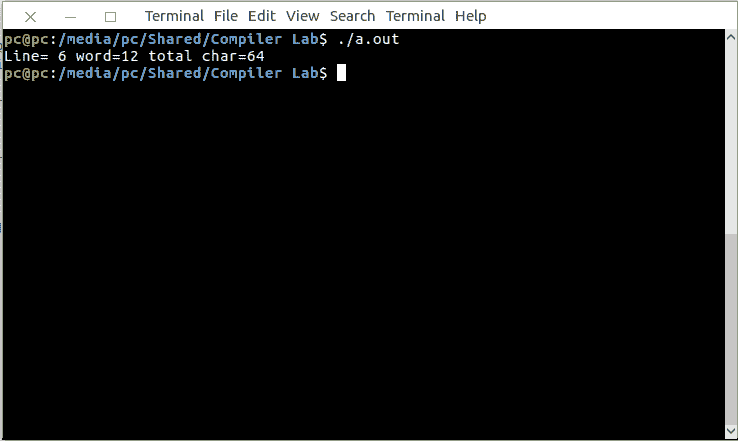

# Lex 程序打印给定输入文件中的全部字符、空格、制表符

> 原文:[https://www . geesforgeks . org/lex-program-to-print-the-total-characters-white-spaces-tab-in-给定输入文件/](https://www.geeksforgeeks.org/lex-program-to-print-the-total-characters-white-spaces-tabs-in-the-given-input-file/)

[Lex](https://www.geeksforgeeks.org/flex-fast-lexical-analyzer-generator/) 是一个生成词法分析器的计算机程序。Lex 读取指定词法分析器的输入流，并输出用 C 编程语言实现 lexer 的源代码。

执行 lex 程序的命令有:

```
lex abc.l (abc is the file name)
cc lex.yy.c -lfl
./a.out

```

让我们看看 Lex 程序如何打印给定输入文件中的全部字符、空格和制表符。

下面是实现:

```
/* Lex program to print the total characters, 
white spaces, tabs in the given input file.
*/

%
{
    int n, w, c;
    %
}
% %
\n { n++; }
[^ \n\t] +
{
    w++;
    c = c + yyleng;
}
.c++;
% % int yywrap(void)
{
    return 1;
}

main()
{
    extern FILE* yyin;
    yyin = fopen("input.txt", "r");
    yylex();
    printf("Line= %d word=%d total char=%d \n", n, w, c);
}
```

**输入:**


**输出:**

