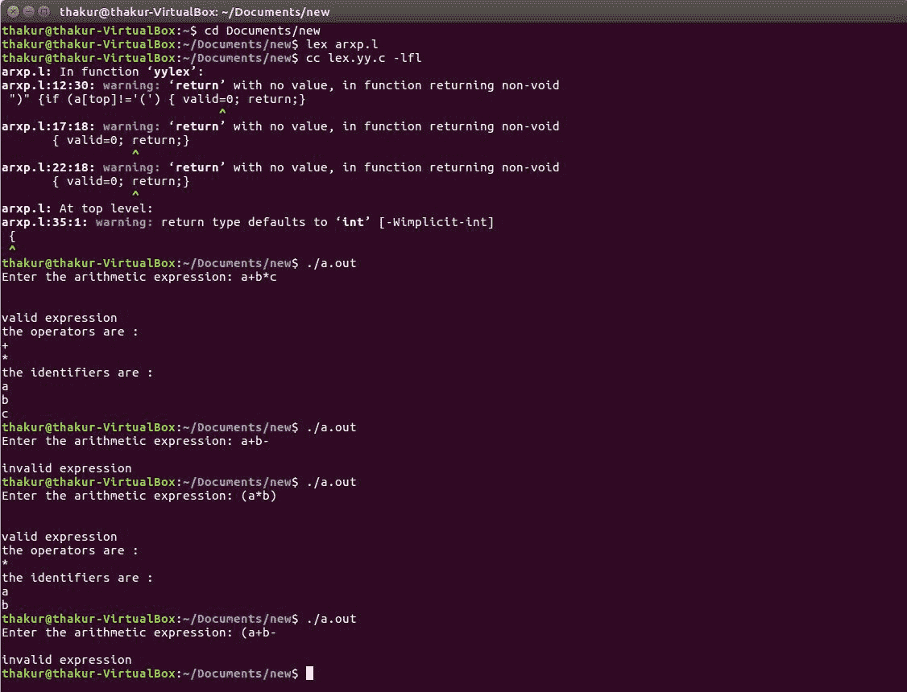

# Lex 程序识别有效算术表达式并识别标识符和运算符

> 原文:[https://www . geesforgeks . org/lex-程序识别有效算术表达式并识别标识符和运算符/](https://www.geeksforgeeks.org/lex-program-to-recognize-valid-arithmetic-expression-and-identify-the-identifiers-and-operators/)

**问题:**编写 Lex 程序，识别有效的算术表达式，识别标识符和运算符。

**说明:**
[Flex(快速词法分析器生成器)](https://www.geeksforgeeks.org/flex-fast-lexical-analyzer-generator/)是 1987 年前后由 Vern Paxson 用 C 语言编写的一个用于生成词法分析器(扫描仪或 lexers)的工具/计算机程序。Lex 读取指定词法分析器的输入流，并输出用 C 编程语言实现 lexer 的源代码。函数 yylex()是运行规则部分的主要灵活函数。

**示例:**

```
Input: a+b*c
Output: valid expression
        the operators are :
        + 
        * 
        the identifiers  are :
        a 
        b 
        c

Input: a+b-
Output: invalid expression

Input: (a*b)
Output: valid expression
        the operators are :
        * 
        the identifiers are :
        a 
        b 

Input: (a+b-
Output: invalid expression 
```

**实施:**

```
/* Lex program to recognize valid arithmetic expression
        and identify the identifiers and operators */
%{ 
#include <stdio.h> 
#include <string.h> 
    int operators_count = 0, operands_count = 0, valid = 1, top = -1, l = 0, j = 0; 
    char operands[10][10], operators[10][10], stack[100]; 
%} 
%%
"(" { 
    top++; 
    stack[top] = '('; 
} 
"{" {
    top++; 
    stack[top] = '{'; 
} 
"[" { 
    top++; 
    stack[top] = '['; 
} 
")" { 
    if (stack[top] != '(') { 
        valid = 0;     
    } 
    else if(operands_count>0 && (operands_count-operators_count)!=1){
        valid=0;
    }
    else{
        top--;
        operands_count=1;
        operators_count=0;
    } 
} 
"}" { 
    if (stack[top] != '{') { 
        valid = 0;     
    } 
    else if(operands_count>0 && (operands_count-operators_count)!=1){
        valid=0;
    }
    else{
        top--;
        operands_count=1;
        operators_count=0;
    } 
} 
"]" { 
    if (stack[top] != '[') { 
        valid = 0; 
    } 
    else if(operands_count>0 && (operands_count-operators_count)!=1){
        valid=0;
    }
    else{
        top--;
        operands_count=1;
        operators_count=0;
    } 

} 
"+"|"-"|"*"|"/" { 
    operators_count++; 
    strcpy(operators[l], yytext); 
    l++; 
} 
[0-9]+|[a-zA-Z][a-zA-Z0-9_]* { 
    operands_count++; 
    strcpy(operands[j], yytext); 
    j++; 
} 
%% 

int yywrap() 
{ 
    return 1; 
} 
int main() 
{ 
    int k; 
    printf("Enter the arithmetic expression: "); 
    yylex(); 

    if (valid == 1 && top == -1) { 
        printf("\nValid Expression\n"); 
    } 
    else
        printf("\nInvalid Expression\n"); 

    return 0;
} 
```

**输出:**

