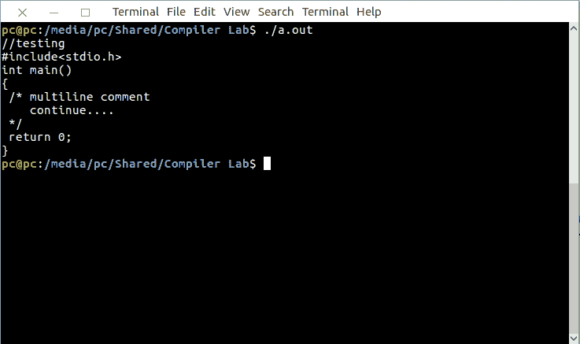
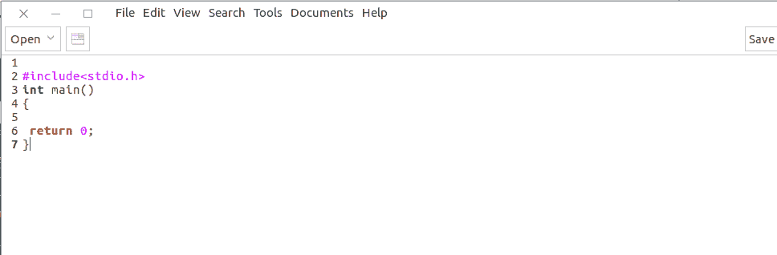

# Lex 程序从 C 程序中删除注释

> 原文:[https://www . geesforgeks . org/lex-program-to-remove-comments-from-c-program/](https://www.geeksforgeeks.org/lex-program-to-remove-comments-from-c-program/)

[Lex](https://www.geeksforgeeks.org/flex-fast-lexical-analyzer-generator/) 是一个生成词法分析器的计算机程序。Lex 读取指定词法分析器的输入流，并输出用 C 编程语言实现 lexer 的源代码。

执行 lex 程序的命令有:

```
lex abc.l (abc is the file name)
cc lex.yy.c -efl
./a.out

```

让我们看看 LEX 程序接受以元音开头的字符串。
**例:**

```
Input : 
//testing
#include 
int main()
{
 /* multiline comment
    continue....
 */
 return 0;
}

Output :
#include 
int main()
{

 return 0;
}

```

下面是实现:

```
/% Lex Program to remove comments from C program 
   and save it in a file %/
/*Definition Section*/
%{
%}

/*Starting character sequence for multiline comment*/
start \/\*
/*Ending character sequence for multiline comment*/
end  \*\/

/*Rule Section*/
%%

/*Regular expression for single line comment*/
\/\/(.*) ;
/*Regular expression for multi line comment*/ 
{start}.*{end} ;

%%

/*Driver function*/
int main(int k,char **argcv)
{
yyin=fopen(argcv[1],"r");
yyout=fopen("out.c","w");
/*call the yylex function.*/
yylex();
return 0;
}
```

**输出:**



