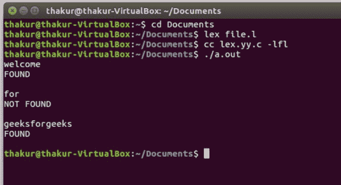

# Lex 程序在文件中搜索一个单词

> 原文:[https://www . geesforgeks . org/lex-program-to-search-a-word-in-a-file/](https://www.geeksforgeeks.org/lex-program-to-search-a-word-in-a-file/)

**问题:**写一个 Lex 程序在文件中搜索一个单词。

**说明:**
[FLEX(快速词法分析器生成器)](https://www.geeksforgeeks.org/flex-fast-lexical-analyzer-generator/)是 Vern Paxson 在 1987 年前后用 C 语言编写的一个用于生成词法分析器(扫描仪或 lexers)的工具/计算机程序。Lex 读取指定词法分析器的输入流，并输出用 C 编程语言实现 lexer 的源代码。函数 yylex()是运行规则部分的主要灵活函数。

**示例:**

```
Input: welcome to geeksforgeeks 
Output: welcome 
FOUND

for 
NOT FOUND

geeksforgeeks
FOUND 
```

**方法:**
为了搜索一个单词，我已经将单词存储在名为“input.txt”的文件中，并使用 lex 从键盘接收单词。收到每个单词后，我会与文件中的单词进行核对。如果找到了这个词，程序会打印“找到”或者“没有找到”。

**输入文件:input.txt** (本程序使用的输入文件)


下面是程序的实现:

```
/* Lex program to search a word in a file */

%{
 /* Definition section */
#include<string.h>
void check(char *);
%}

/* Rule Section */
%%
[a-zA-Z]+ check(yytext);
%%

// driver code
int main()
{
    // The function that starts the analysis 
    yylex();
    return 0;
}
void check(char *str)
{
      /* fp as pointer 
    of File type */
    FILE *fp;
    char temp[30];

    /* fp points to the file input.txt 
    and opens it in read mode */
    fp=fopen("input.txt", "r");
    while((fscanf(fp, "%s", temp))!=EOF)
    {
        if(!(strcmp(temp, str)))
        {
            printf("FOUND\n");
            return;
        }

    }
    printf("NOT FOUND\n");
        return;
}
```

**输出:**

