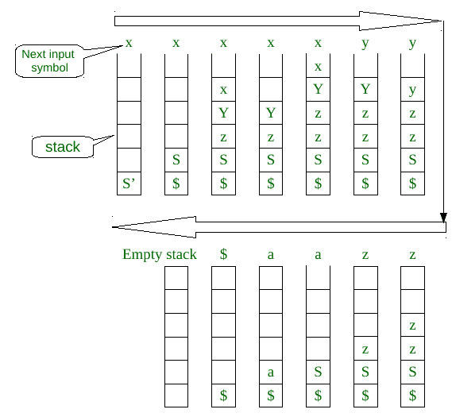
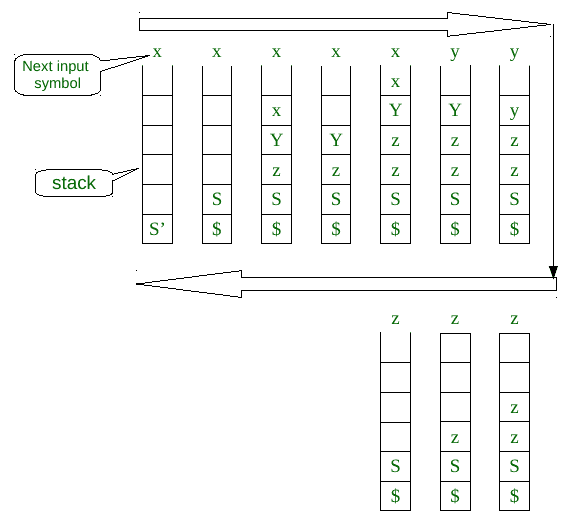

# LL(1)解析算法

> 原文:[https://www.geeksforgeeks.org/ll1-parsing-algorithm/](https://www.geeksforgeeks.org/ll1-parsing-algorithm/)

先决条件— [构建 LL(1)解析表](https://www.geeksforgeeks.org/construction-of-ll1-parsing-table/)。
LL(1)解析是编译器设计的语法分析阶段的一种自顶向下的解析方法。LL(1)解析所需的组件是输入字符串、堆栈、给定语法的解析表和解析器。这里，我们讨论一个解析器，它确定给定的字符串是否可以从给定的语法(或解析表)中生成。
假设给定的语法是 G = (V，T，S，P)
其中 V-变量符号集，T-终端符号集，S-起始符号，P-生产集。

**LL(1)解析器算法:**
**输入-** 1。stack = S //stack 最初只包含 S.
2。输入字符串= w$
其中 S 是语法的起始符号，w 是给定的字符串，而$用于字符串的结尾。
3。PT 是以矩阵或 2D 数组形式的给定语法的解析表。

**输出-** 确定给定的字符串是否可以由给定的语法(解析表)产生，如果不能，则产生错误。

**步骤:**

```
1\. while(stack is not empty) {

       // initially it is S
2\.     A = top symbol of stack;  

       //initially it is first symbol in string, it can be $ also
3\.     r = next input symbol of given string; 
4\.     if (A∈T or A==$) {
5\.         if(A==r){
6\.             pop A from stack;
7\.             remove r from input;
8\.         }
9\.         else
10\.             ERROR();
11\.     }
12\.     else if (A∈V) {
13\.         if(PT[A,r]= A⇢B1B2....Bk) {
14\.             pop A from stack;

                // B1 on top of stack at final of this step
15\.             push Bk,Bk-1......B1 on stack  
16\.         }
17\.         else if (PT[A,r] = error())
18\.             error();
19\.     }
20\. } 
// if parser terminate without error() 
// then given string can generated by given parsing table.
```

**时间复杂性**
正如我们所知，一种语言的语法规模是有限的。比如，有限数量的变量、终端和产品。如果语法是有限的，那么它的 LL(1)解析表的大小也是有限的。让

*   *p* 是所有作品的 RHS 中琴弦长度的最大值
*   *l* 是给定字符串的长度，并且

*l* 比 *p* 大很多。*如果算法第 4 行的*块总是运行 0(1)次。*否则如果算法中第 12 行的*块将 *O(|P|*p)* 作为单个下一个输入符号的上限。而 *while 循环*可以运行超过 *l* 次，但是我们已经考虑了在 *O(|P|*p)* 中对单个下一个输入符号重复 *while 循环*。总的时间复杂度是

```
       T(l) = O(l)*O(|P|*p)
              = O(l*|P|*p)
              = O(l)           { as l >>>|P|*p }
```

该算法的时间复杂度是输入字符串长度的数量级。

**与上下文无关语言(CFL)的比较:**
LL(1)语法中的语言是 CFL 的适当子集。使用 CYK 算法，我们可以为给定的上下文无关语法(CFG)找到字符串的成员关系。CYK 用 *O(l <sup>3</sup> )* 时间进行 CFG 的成员资格测试。但是对于 LL(1)语法，我们可以在 *O(l)* 时间内做一个隶属度测试，这个时间使用上面的算法是线性的。如果我们知道给定的 CFG 是 LL(1)语法，那么使用 LL(1)解析器进行解析，而不是使用 CYK 算法。

**例–**
让语法 *G = (V，T，S’，P* 为

```
*S' **→ S$***
*S → xYzS | a*
*Y → xYz | y*
```

该语法的解析表(*PT*)

<figure class="table">

|   | ***一*** | ***×T2】*** | ***y*** | ***z*** | ***$*** |
|  | *S’→S $* | *S’→S $* | *错误* | *错误* | *错误* |
| ***S*** | *S → a* | *S → xYzS* | *错误* | *错误* | *错误* |
| ***Y*** | *错误* | *Y → xYz* | *Y → y* | *错误* | *错误* |

```
Let *string1 = xxyzza*,
```

我们必须用这个字符串添加 *$* ，
我们将使用上面的解析算法，流程图为:



对于*字符串 1* 我们得到了一个空堆栈，while 循环或算法终止时没有错误。所以， *string1* 属于给定语法的语言 *G* 。

```
Let *string2 = xxyzzz*,
```

与上面相同，我们将使用算法解析字符串 2，如下图



对于*字符串 2* ，在上图最后一个阶段，当栈顶为 *S* ，字符串的下一个输入符号为 *z* ，但是在*PT【S，z】=错误*。算法因错误而终止。所以， *string2* 不是语法 *G* 的语言。

</figure>