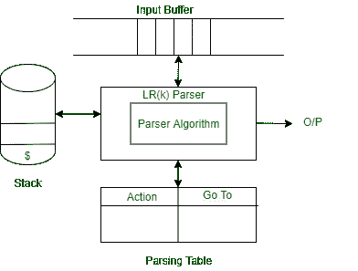

# LR 解析器

> 原文:[https://www.geeksforgeeks.org/lr-parser/](https://www.geeksforgeeks.org/lr-parser/)

在本文中，我们将讨论 LR 解析器及其概述，然后讨论算法。此外，我们将讨论解析表和 LR 解析器工作图。我们一个一个来讨论。

[**【LR】**](https://www.geeksforgeeks.org/difference-between-ll-and-lr-parser/)**[**解析器**](https://www.geeksforgeeks.org/types-of-parsers-in-compiler-design/) **:**
LR 解析器是一种自下而上的上下文无关语法解析器，非常普遍地被计算机编程语言编译器和其他相关工具使用。LR 解析器从左到右读取它们的输入，并产生最右边的派生。它被称为自下而上的解析器，因为它试图通过从叶子开始构建来减少顶层的语法生成。LR 解析器是实践中所有确定性解析器中最强大的解析器。**

****

****LR 解析器描述:**
解析器术语 LR(k)解析器，这里的 L 指的是从左到右的扫描，R 指的是反向最右边的派生，k 指的是用于做出解析器决策的未消耗的“前瞻”输入符号的数量。通常，k 是 1，经常被省略。如果 LR (k)解析器存在，则上下文无关语法称为 LR (k)。这首先减少了左边的记号序列。但是当我们从上面阅读时，推导顺序首先扩展到非终结。**

1.  **堆栈是空的，我们希望将规则减少 S'→S$。**
2.  **使用“.”in 规则表示堆栈中已经有多少规则。**
3.  **点状项目，或者简单地说，该项目是一个生产规则，带有一个点，指示到目前为止已识别出多少 RHS。关闭物料用于查看哪些生产规则可用于扩展当前结构。计算如下:**

****LR 解析器的规则:**
LR 解析器的规则如下。**

1.  **给定语法规则中的第一项将自身添加为第一个封闭集。**
2.  **如果一个对象出现在形式 A→ α的闭包中。β.γ，其中符号后的下一个符号是非终结符，添加符号的生产规则，其中点在第一项之前。**
3.  **对于在(B)项下添加的新项目，重复步骤(B)和(C)。**

****LR 解析器算法:**
LR 解析算法对所有解析器都是一样的，但是每个解析器的解析表是不同的。它由以下组件组成。**

1.  ****输入缓冲区–**
    它包含给定的字符串，并以$符号结束。** 
2.  ****Stack–**
    状态符号和当前输入符号的组合用于引用解析表，以便做出解析决定。**

****解析表** :
解析表分为两部分——动作表和转到表。**动作表**给出了在输入流中实现给定的当前状态和当前终端的语法规则。行动表中使用了以下四种情况。**

1.  **移位动作-在移位动作中，当前终端从输入流中移除，并且状态***【n】***被推到堆栈上，并且它成为新的当前状态。**
2.  **减少动作-数字 ***m*** 被写入输出流。**
3.  **规则左侧提到的符号***【m】******m***表示状态从堆栈中移除。**
4.  **规则左侧提到的符号***【m】*****m**表示在 goto 表中查找一个新的状态，并通过将其推送到堆栈上来创建新的当前状态。**

```
An accept - the string is accepted
No action - a syntax error is reported
```

****注意–**
**转到表**指示应该进入哪个状态。**

****LR 解析器图:****

****